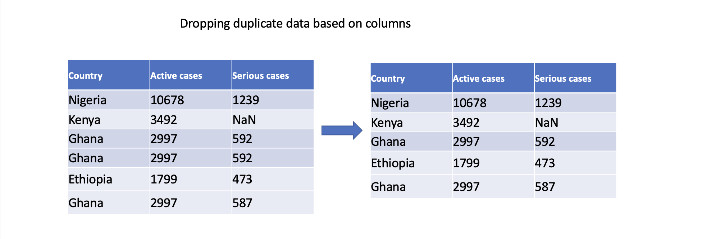

# 🔢 Data cleaning techniques
As a data scientist, we'll be working with lots of messy (or smelling 😖) data everyday. However, it is critical to ensure the accuracy, reliability, and integrity of the data by carefully _cleaning_ the data (without water 😁). In this lesson, we'll be looking at different data cleaning techniques needed to get the data ready for further analysis. First, we'll start by exploring techniques needed to handle `missing data`, and then we'll dive into what to do with `duplicate` data. 


<aside>

**_What is data cleaning?_**

_Data cleaning,_ also known as _data cleansing_ or _data preprocessing_. It involves identifying and correcting errors, inconsistencies, and inaccuracies in the dataset to ensure its quality and reliability for further analysis. 

</aside>

Data cleaning aims to improve the integrity, completeness, and consistency of the data. When cleaning a data, our goal will be to produce a clean and reliable dataset that is ready for further analysis. By investing time and effort into data cleaning, we can improve the accuracy and credibility of our analysis results, leading to more robust and reliable insights. To understand this more, we'll be looking at the following

- Handling missing data
- Removing duplicate data values 
- Handling inconsistencies with Dates
<!--
- Dealing with outliers -->


<aside>

**Notes**
- We'll be using Pandas throught this lesson to clean our dataset.
- In a Pandas dataframe, missing values are represented with `NaN`.

</aside>


### 1. Handling missing data
Missing data is one of the most frequently occuring problems you can face as a data scientist. Watch the next video to have an idea of how important it is to understand this problem, and possible causes.

> 📺 How important are missing data? 👨🏾‍💻 

<div style="position: relative; padding-bottom: 56.25%; height: 0;"><iframe src="https://www.youtube.com/embed/BqtTcOtkp6Y" title="Web Scrapping Intro" frameborder="0" allow="accelerometer; autoplay; clipboard-write; encrypted-media; gyroscope; picture-in-picture" allowfullscreen style="position: absolute; top: 0; left: 0; width: 100%; height: 100%; border: 2px solid grey;"></iframe></div>

As a data scientist, there are many ways of dealing with missing values in a data. For this lesson, we'll be looking at 4 different techniques of handling missing data -  _dropping, filling with constant, filling with statistics, and _interpolation_. 

#### Dropping missing values
One straightforward approach is to remove rows or columns with missing values using the `dropna()` function. By specifying the appropriate axis parameter, you can drop either rows `(axis=0)` or columns `(axis=1)` that contain any missing values. However, this approach should be used with **caution** as it may result in a **loss of valuable data**.

```
    # Drop column with any missing values
    df.dropna(axis=1, inplace=True)

    # Drop rows with any missing values
    df.dropna(axis=0, inplace=True)

```


#### Filling with constant
You can also fill missing values with a constant value using the `fillna()` function. This can be done for specific columns or the entire DataFrame. For example, filling missing values with zero:

    # Fill missing values in a specific column
    df['Serious cases'].fillna(0, inplace=True)

    # Fill missing values in the entire DataFrame
    df.fillna(0, inplace=True)


#### Filling missing values with statistics
Another approach is to fill missing values with summary statistics, such as _mean, median_, or _mode_. Pandas provides convenient functions like `mean()`, `median()`, and `mode()` to compute these statistics. For example, filling missing values with the mean of column `Serious cases`:

    # Fill missing values in a specific column with the mean
    df['Serious cases'].fillna(df['Serious cases'].mean(), inplace=True)


#### Filling with interpolation
Pandas supports different interpolation methods to estimate (i.e., predict) missing values based on existing data points. The `interpolate()` function fills missing values using linear interpolation, polynomial interpolation, or other interpolation techniques.

    # Interpolate missing values in a specific column
    df['Serious cases'].interpolate(inplace=True)


These are just a few examples of how Pandas can handle missing data. The choice of approach depends on the specific dataset, the nature of the missing values, and the analysis goals.

### 2. Removing duplicates
Duplicate data are rows or records within a dataset with similar or nearly identical values across all or most of their attributes.
This can occur due to various reasons, such as data entry errors, system glitches, or merging data from different sources. As a data scientist, there are number of ways to handle duplicate data in a small or large dataset. First, let's have a look at how we can identify if our data set has duplicate record, and in which column they exist.

#### Identifying duplicate data
To identify existence duplicate data in a dataset, the `duplicated()` function in Pandas is suitable for this. It returns a boolean value of either `True` or `False` for each of the rows. By using the `keep` parameter, you can control which occurrence of the duplicated values should be considered as non-duplicate. For example, we can check for duplicate using

    # Identify duplicate rows
    duplicate_rows = df.duplicated()

    # Identify all occurrences of duplicates (including the first occurrence)
    duplicate_rows_all = df.duplicated(keep=False)


#### Dropping duplicate data
To remove duplicate data, a common option is to drop (or remove) the entire row. There are 3 main types of data duplication -

- **Exact duplicates**: rows with the same values in all columns.
- **Partial duplicates**: rows with the same values in some columns.
- **Duplicate keys**: rows with the same values in one or more columns, but not all columns.

We'll only focus on exact duplicates in this section. To remove duplicate rows from a DataFrame, you can use the `drop_duplicates()` function. This function drops duplicate rows, keeping only the first occurrence by default. However, if you want to remove duplicates including the first occurence, then you can use the `keep` parameter.

    # Drop duplicate rows, keeping the first occurrence
    df.drop_duplicates(inplace=True)

    # Drop all occurrences of duplicates (keeping none)
    df.drop_duplicates(keep=False, inplace=True)


We can also specify specific columns to determine duplicates. Only rows with identical values in the specified columns will be considered duplicates.

    # Drop duplicate rows based on specific columns
    df.drop_duplicates(subset=['Serious cases'], inplace=True)



In conclusion, addressing duplicate data is crucial to ensuring accurate analysis, maintain data integrity, derive reliable insights, and support consistent decision-making. By effectively handling duplicate data, we can work with clean and reliable datasets, leading to more robust and trustworthy analysis outcomes.


### 👩🏾‍🎨 Practice: COVID-19 Dataset 🎯
In this exercise, you'll practice the techniques you've learnt so far. Using the COVID-19 dataset, try the following... 
1. Identify a column with missing data, and try the above techniques for handling missing data.
2. Are there duplicate rows in the dataset? If yes, remove the duplicates by specifying the column with duplicates.
3. Insert a snippet of your cleaned dataset in the padlet below.
    
    **[https://padlet.com/curriculumpad/draw-the-building-blocks-b1yn0aft11t9n4ox](https://padlet.com/curriculumpad/draw-the-building-blocks-b1yn0aft11t9n4ox)**

> ➡️ In the next section, you'll be introduced to  `Data Normalization` and `Transformation`.

