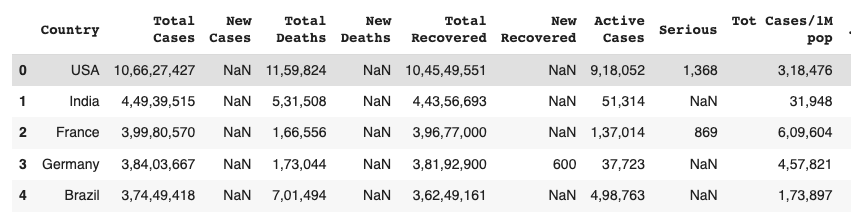

# Data Loading and Exploration
So far we've explored some tools used in data science, and now is the time to start using them. Remember we looked at data and different sources or orgin of data. However, as a data scientist, you need to know how to import or get this data from different sources, and work with them. In this lesson, you'll learn how to import and use data from a file (.csv) and API using a popular python libray called `Pandas`. 


## Data loading
In data science, one of the fundamental tasks is loading data into our analysis environment. We'll be work with diverse data sources, ranging from structured datasets stored in CSV files to real-time data obtained through APIs. In this section, we will explore how to load data from CSV files and APIs using Pandas.
Before we get started with Pandas, let first look at how we can create a notebook (i.e., the file containing our codes and analysis) on <a href="https://colab.research.google.com/" target="_blank">google colab</a>. 

> 📺 **How to create a notebook on colab** 👨🏾‍💻

<div style="position: relative; padding-bottom: 56.25%; height: 0;"><iframe src="https://www.youtube.com/embed/vxHWMT8vHFg" title="Web Scrapping Intro" frameborder="0" allow="accelerometer; autoplay; clipboard-write; encrypted-media; gyroscope; picture-in-picture" allowfullscreen style="position: absolute; top: 0; left: 0; width: 100%; height: 100%; border: 2px solid grey;"></iframe></div> 

In summary...
- Remember you need an active google account to do this.
- In your browser, goto <a href="https://colab.research.google.com/" target="_blank">https://colab.research.google.com</a>
- click on `file` and create a new notebook.

Now that you understanding how to create a workbook, we'll begin by looking at how we can load data from a csv file using Pandas. For this, we'll be using the <a href="https://drive.google.com/file/d/1GzZqbDCVBdcVL6T3WQsKOyXmo32EaSU5/view?usp=sharing" target="_blank"> COVID-19 </a> dataset you explored in `section 1.4`.

### Pandas
<aside>

**_Definition..._**

Pandas is a fast, powerful, flexible and easy to use data analysis tool built for analyzing, cleaning, exploring, and manipulating data. It represent data as DataFrames i.e., a table with rows and columns.

</aside>

### Loading data from CSV
<br>
Loading data from CSV files using Pandas is a fundamental skill for every data scientist. It provides a convenient way to import data into a structured format for further analysis and exploration. To load a CSV file using Pandas, the first step is to import the Pandas library in your notebook.  

```

    import pandas as pd

```
Using the alias `pd` allows you to refer to Pandas as `pd`. Next, we can use the `read_csv()` function provided by Pandas to read the CSV file into a Pandas DataFrame. The read_csv() function takes the file path (or file location) as input and returns a DataFrame object. To read a CSV file from google drive, you can either specify a file path to your google drive after mounting it or upload it to colab.

<details>
    <summary>How to link notebook to google drive</summary>

<div style="position: relative; padding-bottom: 56.25%; height: 0;"><iframe src="https://www.youtube.com/embed/VCllZKM7Njk" title="Web Scrapping Intro" frameborder="0" allow="accelerometer; autoplay; clipboard-write; encrypted-media; gyroscope; picture-in-picture" allowfullscreen style="position: absolute; top: 0; left: 0; width: 100%; height: 100%; border: 2px solid grey;"></iframe></div> 
</details>

```

    df = pd.read_csv('path/to/your/corona_virus.csv')

```

By default, read_csv() assumes that the CSV file has a header row containing column names. If the CSV file does not have a header row, we can set the `header` parameter to `None`. 

```

    df = pd.read_csv('path/to/your/corona_virus.csv', header=None)

```

Once the data is loaded into a DataFrame, Pandas offers a wide range of methods for data exploration and manipulation. You can examine the data using functions like head(), tail(), and describe() to get a glimpse of the dataset's structure and statistical summaries. Now that you've successfully loaded your dataset into Pandas DataFrame, let's see what the data looks like by viewing some rows using Pandas `.head()` function.

```

    df.head()

```



> ✨ Awesome! You've successfully read your first CSV file using Python and Pandas.

### Loading data from API
In addition to loading data from static files like CSV, data scientists often work with real-time data obtained through APIs. To load data from an API, we typically make HTTP requests and retrieve the data in a structured format, such as JSON (JavaScript Object Notation). Pandas provides convenient functions to handle JSON data and convert it into a DataFrame.

To fetch data from an API, we can use the `requests` library in Python to send HTTP requests, and then use Pandas to parse and structure the retrieved data. For this, we'll be using the previous API we used in  First, let's import both Pandas and the request libary.

```

    import pandas as pd
    import requests 

```

Next, we send an HTTP GET request to the specified API and receive a response. The response is typically in JSON format, which can be directly converted into a DataFrame using Pandas.

```

    # Make a request to the API
    response = requests.get('https://api.unibit.ai/v2/stock/historical/?tickers=AAPL&accessKey=demo')

    # Convert JSON response to DataFrame
    data = pd.DataFrame(response.json())

```


### 👩🏾‍🎨 Practice: Explore Pandas function 🎯
In this lesson, we've seen how to read data from CSV and API, and how to get a view of our data using `head()` function. Now you need to explore other Pandas functions.
1. Using the DataFrame you loaded from the CSV, what type of information do you get when you use `describe()` and `tail()` function?
2. Share your answer using the padlet below.
    
    **[https://padlet.com/curriculumpad/draw-the-building-blocks-b1yn0aft11t9n4ox](https://padlet.com/curriculumpad/draw-the-building-blocks-b1yn0aft11t9n4ox)**


> ➡️ In the next section, you'll be introduced to `data cleaning` 🏙️.

