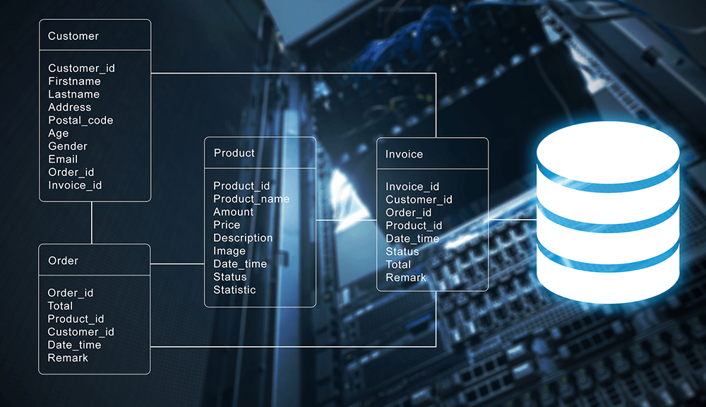
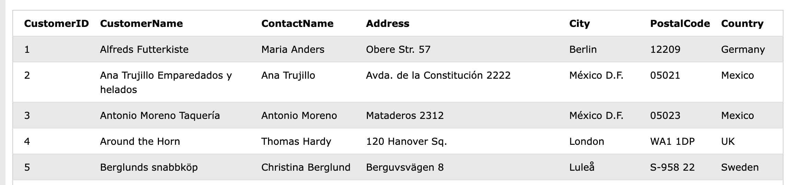
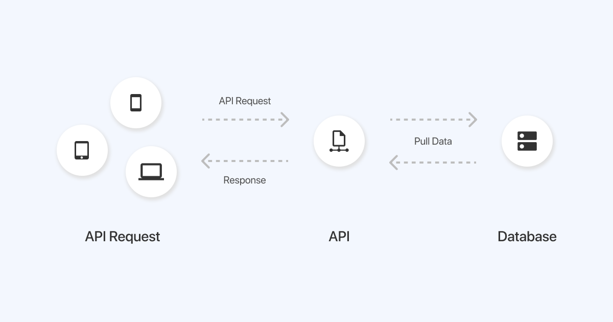

# Data Sources and Collection
As a data scientist, you'll work with different types of data from different sources. It is important to understand not just these data sources but also how to collect the data therein. To achieve this, we'll be looking at 4 different data sources; _databases, APIs, web scraping_, and _data streams_.


### _What are data sources?_

<aside>

**_Definition..._**

Data sources are locations where historic, live, static or streaming data originates from. These sources allow data to be stored, managed, and accessed while holding either raw and/or refined data.

</aside>

## 1. Databases
A database is an organized collection of structured information, or data, typically stored electronically in a computer system. Databases can store information about people, products, orders, transactions, or anything else using one or multiple tables. Each table is made up of rows and columns in a relational database, and records within each table is identified using a **primary key**. For example, the image below shows 4 tables; _Customer, Order, Product_, and _Invoice_. Each of this table has a primary key (Customer_id, Order_id, Product_id, Invoice_id) to  uniquely identifies each record.



As shown below, multiple tables are linked together for easy access and retrieval. All this is usually controlled by a database management system (DBMS), where data can then be easily accessed, managed, modified, updated, and organized using _Structured Query Language (SQL)_.  An example SQL query to retrieve customers' record from a database is given below.

> **Note**: the table name and the retrieved data are imaginary

<code>

| Query                             | Description                                                    |
| --------------------------------- | -------------------------------------------------------------- |
| **SELECT * FROM CUSTOMER** | Retrieve all records or data from the customer table |

</code>

After running the query above, an example data that could be retrieved is given in the table below. It is evident that are modelled into rows and columns where each row represent a customer information.



## 2. Application Programming Interface (API)

<aside>

**Definition...**

API is a method of allowing two or more applications to talk to each other using an agreed protocol (or rule). This means one application would be able to access certain data or information from the other.

</aside>

When we pull or check our phone for weather data, a request will be sent to your weather app which resides on a server that stores all the weather information. Behind the scene, an API is used to send a request to the weather app server and gotten a response which is the weather data you see on your phone. As depicted below, an API serves as an intermediary that allows a data scientist to access data from databases or other locations.

> 


Now, let us look at different format of data we can get while using an API. As a data scientist, the most common data format are `csv, json`, and `xml`. Below is a summary with example of how each of this data format looks like.

#### JSON
JSON is a `key-value` pair data format and has become one of the most popular format of sharing information in recent times. A file contain json data is saved using `.json` file extension. A sample json data about a pizza oder is given below

<code>

```
    {
        "crust"": "original",
        "toppings"": ["cheese","pepperoni"", "garlic""],
        "price"": "29.99",
        "shipping"": "delivery",
        "status"": "cooking"
    }
```

</code>

#### CSV
Comma Separated Value (CSV) is a popular data format in the data science communities, with a plain text file that uses specific structuring to arrange tabular data. It uses a comma (`,`) to separate each specific data value. A csv data is saved in a file with `.csv` extension. A sample csv data is given below

<code>

    name,department,birthday month
    John Smith,Accounting,November
    Erica Meyers,IT,March
    Bruce Lee,Art,August
    
</code>

In the example above, the first line identifies the column name, and every subsequent line after that is the actual data.

#### Extensible Markup Language (XML)
XML is the data exchange format for API prior to JSON. It’s a markup language that’s both human and machine readable, and represent structured information such as documents, data, configuration, books, transactions, invoices, and much more.   Data in xml format can be saved in a file with .xml extension, and an example is given below showing data about a message from bruce to john.

```
    <Message>
        <to>Bruce Lee</to>
        <from> John Doe</from>
        <heading> Don't Forget </heading>
        <body> Please, don't forget my request </body>
    </Message>
```

## 3. Web Scraping
<aside>

**_Definition..._**

Web Scraping are different techniques used to automatically extract or `scrape` data from the web. These data can be unstructured or semi-structured, and most websites make their data publicly available to scrapers.

</aside>

> 📺 What is web scraping? listen to PyCoach! 👨🏾‍💻 

<div style="position: relative; padding-bottom: 56.25%; height: 0;"><iframe src="https://www.youtube.com/embed/dlj_QL-ENJM?start=21" title="Web Scrapping Intro" frameborder="0" allow="accelerometer; autoplay; clipboard-write; encrypted-media; gyroscope; picture-in-picture" allowfullscreen style="position: absolute; top: 0; left: 0; width: 100%; height: 100%; border: 2px solid grey;"></iframe></div>

While it is possible to scrape all kinds of web data from search engines and social media to government information, it doesn’t mean this data is always available. Depending on the website, you may need to employ a few tools and tricks to get exactly what you need, and also covert it into a format suitable for your project


## 4. Data Streams

<aside>

**_Definition..._**

**_Data streams_** Data streams refer to continuous sequences of data that are generated and received in real-time or near real-time from various sources such as sensors, social media feeds, financial markets, website clickstreams, and IoT devices.

</aside>

> 📺 What is _data streaming_? watch this video from Confluent! 👨🏾‍💻 

<div style="position: relative; padding-bottom: 56.25%; height: 0;"><iframe src="https://www.youtube.com/embed/Sgrks7ssGOA?start=1" title="Web Scrapping Intro" frameborder="0" allow="accelerometer; autoplay; clipboard-write; encrypted-media; gyroscope; picture-in-picture" allowfullscreen style="position: absolute; top: 0; left: 0; width: 100%; height: 100%; border: 2px solid grey;"></iframe></div>

In summary, remember the following about data streams...
- they are continuous sequences of data that are generated in real-time.
- they require specialized techniques and platforms for processing and analysis to derive insights and make informed decisions.
- Data scientists and analysts need specialized techniques to handle data streams effectively.
- it has numerous applications across industries, including real-time analytics, fraud detection, recommendation systems, and monitoring of network or infrastructure performance.
- organizations can gain valuable insights, respond quickly to emerging trends or events, and make data-driven decisions

### 👩🏾‍🎨 Practice: Describe JSON and XML Data... 🎯
In this exercise, you'll access data from sample APIs using your browser. With this, you'll have hands-on experience on JSON and XML data. Try the following in your browser.
1. Open your browser
2. copy and paste each of the url below in your browser <br>
    
    <aside>
    
    1. [https://api.unibit.ai/v2/stock/historical/?tickers=AAPL&accessKey=demo](https://api.unibit.ai/v2/stock/historical/?tickers=AAPL&accessKey=demo)
    2. [http://restapi.adequateshop.com/api/Traveler?page=1](http://restapi.adequateshop.com/api/Traveler?page=1)

    </aside>

3. Describe what each data from the APIs is all about in the padlett below
    **[https://padlet.com/curriculumpad/draw-the-building-blocks-b1yn0aft11t9n4ox](https://padlet.com/curriculumpad/draw-the-building-blocks-b1yn0aft11t9n4ox)**

> ➡️ In the next section, you'll be introduced to `data loading` and `data exploration` 🏙️.

