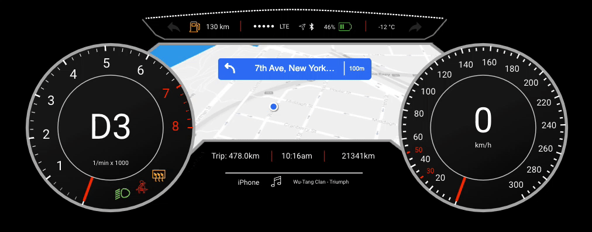

# Creating dashboards
Creating dashboards in Looker is like building a control panel for your data — it gives you a clear, organized view of important information all in one place. Imagine you're driving a car and your dashboard shows you everything you need to know about your journey — like speed, fuel level, and navigation. 

In the same way, Looker dashboards display key metrics and insights from your data, helping you make informed decisions and steer a business in the right direction through data. To create a dashboard, `Charts` are an important component we can piece together to tell different stories and reveal valuable insights about a data.

## Charts in Looker

<aside>

**_Definition..._**

**Charts** in data visualization are graphical representations of data that help to illustrate patterns, trends, and relationships within our datasets. They provide a visual way to interpret and understand complex information quickly and easily.
</aside>

<iframe src="https://edpuzzle.com/embed/assignments/661c5a1905809bf236e5070c/watch" title="Data Visualization" frameborder="0" allow="accelerometer; autoplay; clipboard-write; encrypted-media; gyroscope; picture-in-picture" allowfullscreen style="position: absolute; top: 0; left: 0; width: 100%; height: 100%; border: 2px solid grey;"></iframe>

In summary...
- Looker Studio offers various types of charts for data visualization, including tables, pie charts, time series charts, interactive bar charts, geo charts, line charts, scatter charts, pivot tables, bullet charts, treemap charts, and so on.
- Each chart type has specific configurations and settings for customization, such as selecting dimensions and metrics and changing chart types.
- Charts can be adjusted to display different metrics, such as impressions, clicks, conversions, return-on-investment (ROI), average order value, etc.
- Some chart types are more suitable for specific purposes, such as scorecards for displaying KPIs, time series charts for tracking trends over time, and scatter charts for observing relationships.

That's a lots of chart to master 🤔 at this level. Don't worry, we'll only be focusing on a few important ones.

### 1. KPIs
Imagine you're driving a car and you have a dashboard that shows your _speed_, _fuel level_, and _distance traveled_. KPIs are like the numbers on that dashboard which tells you how well you're doing at a glance. For example, if you're aiming to drive at `60 mph`, the KPI would show your current speed compared to that target.

KPIs (Key Performance Indicators) provide a high-level overview of important metrics or performance indicators, typically displayed as numeric values or gauges. They offer a quick snapshot of performance against predefined targets or benchmarks. Let's practice through the video below how we can create _KPIs_ as part of our reports.

> **How can i create _KPIs_ as part of my reports?**

<iframe src="https://www.youtube.com/embed/98-NQxW3xHg?si=YMyxcOaqDotP3ozF" title="Data Visualization" frameborder="0" allow="accelerometer; autoplay; clipboard-write; encrypted-media; gyroscope; picture-in-picture" allowfullscreen style="position: absolute; top: 0; left: 0; width: 100%; height: 100%; border: 2px solid grey;"></iframe>

### 2. Bar Chart
Picture a bar graph at a candy store showing how many of each candy bar they've sold. Each candy bar has its own bar, and the taller the bar, the more of that candy was sold. It's an easy way to see which candy is the most popular without having to count every single sale.

Bar charts are commonly used to compare categorical data by representing values as rectangular bars of varying lengths. They are effective for visualizing **differences** or **trends** across different categories or groups. Let's practice through the video below how we can create _Bar charts_ as part of our reports.

> **How can i create _Bar charts_ as part of my reports?**

<iframe src="https://www.youtube.com/embed/TwWFqr_OguI?si=PNAG4tSjAwuwwCCD" title="Data Visualization" frameborder="0" allow="accelerometer; autoplay; clipboard-write; encrypted-media; gyroscope; picture-in-picture" allowfullscreen style="position: absolute; top: 0; left: 0; width: 100%; height: 100%; border: 2px solid grey;"></iframe>

### 3. Scatter Plots
Imagine you're tracking the height and weight of different animals at the zoo. Each animal is a dot on a graph, with their weight on one side and their height on the other. Scatter plots help you see if there's a connection between weight and height—if bigger animals tend to be taller, for example.

Scatter plots are used to visualize the relationship between two variables by plotting individual data points on a graph with horizontal and vertical axes. They help identify patterns, correlations, or outliers within the data. Let's practice through the video below how we can create _Scatter plots_ as part of our reports.

> **How can i create _Scatter plots_ as part of my reports?**

<iframe src="https://www.youtube.com/embed/LSjQ9-shcso?si=qYzbxJ8wRg0RU-Pn" title="Data Visualization" frameborder="0" allow="accelerometer; autoplay; clipboard-write; encrypted-media; gyroscope; picture-in-picture" allowfullscreen style="position: absolute; top: 0; left: 0; width: 100%; height: 100%; border: 2px solid grey;"></iframe>

### 3. Pivot Tables
Think of a pivot table like a big box of Lego bricks. You can rearrange the bricks in different ways to build different things. With a pivot table, you can rearrange your data to see it from different angles. For example, you might organize sales data by month to see which months had the most sales, or by product to see which products sold the best.

Pivot tables allow users to summarize and analyze large datasets by dynamically reorganizing rows and columns to view data from different perspectives. It offer flexibility in aggregating and exploring data across multiple dimensions.

> **How can i create _Pivot tables_ ?**

<iframe src="https://www.youtube.com/embed/PsJB60u9E8o?si=8oScl9qTqzTTVSTO" title="Data Visualization" frameborder="0" allow="accelerometer; autoplay; clipboard-write; encrypted-media; gyroscope; picture-in-picture" allowfullscreen style="position: absolute; top: 0; left: 0; width: 100%; height: 100%; border: 2px solid grey;"></iframe>

### 5. Maps
Maps are like the ones you see in a GPS devic which shows you where things are located in the world. In data visualization, maps can show you where your customers are located, where your stores are located, or any other geographic information you might have. 

They are useful for displaying regional patterns, trends, or distributions within the data.

> **How can i create _Geo location_ or _Maps_ as part of my Report?**

<iframe src="https://www.youtube.com/embed/N-FtqT-n0T8?si=JMBYjspsg-BGcMIc" title="Data Visualization" frameborder="0" allow="accelerometer; autoplay; clipboard-write; encrypted-media; gyroscope; picture-in-picture" allowfullscreen style="position: absolute; top: 0; left: 0; width: 100%; height: 100%; border: 2px solid grey;"></iframe>

<aside>

**➡️ In the next section...**
- We'll look at some practice exercises on how to create cool dashboards.
</aside>