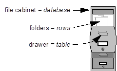

## Introduction to Databases
A **_database_** is like a digital filing cabinet where we store all sorts of information in an organized way, making it easy to find and use when we need it. We need databases because they help us keep track of everything from our shopping lists and favorite songs to important customer information for businesses, making sure nothing gets lost or forgotten.

<aside>

**_Definition..._** 

**_Databases_** are organized collections of data that allow for the efficient storage, retrieval, and manipulation of information. They're like digital filing cabinets where data is stored in a structured way so that it can easily be found and used.
</aside>

<iframe src="https://www.youtube.com/embed/X7v0O8yiUuY?si=8Q3GfBXFmhxBQXM9" title="Sample Data Science Project" frameborder="0" allow="accelerometer; autoplay; clipboard-write; encrypted-media; gyroscope; picture-in-picture" allowfullscreen style="position: absolute; top: 0; left: 0; width: 100%; height: 100%;"></iframe>

- **Why Use Databases?** Businesses use databases to manage everything from customer information and inventory levels to employee records and financial transactions. They help in making informed decisions by providing quick access to important data.

**Simple Practice**: Think of a library's catalog system. How might it be similar to a database in terms of organizing and finding books?

### Types of Databases
- **Relational Databases**: These databases store data in tables, much like spreadsheets, with rows representing records and columns representing attributes. SQL (Structured Query Language) is used to interact with these databases.
- **Non-Relational Databases (NoSQL)**: These are more flexible databases designed to handle unstructured data like documents, images, and JSON objects. They are best when the data doesn't fit neatly into tables.

**Simple Practice**: For a local grocery store, list what kind of information might be stored in a relational database (e.g., product name, price, quantity) versus what might be better suited for a non-relational database (e.g., customer feedback text, images of products).

### Database Terminology
- **Tables**: Think of a table as a spreadsheet where data about a particular category is stored. For example, a "Customers" table might store information about customers.
- **Rows and Columns**: Each row (record) in a table represents a unique piece of data, like a single customer. Columns (fields) represent the attributes of that data, such as name, email, and phone number.
- **Schema**: A schema is the blueprint of a database that defines how data is organized, including the tables, fields, and relationships between tables.

**Simple Practice**: Draw a simple table on paper for a "Pets" database with columns for Pet ID, Name, Type (e.g., dog, cat), and Owner ID. This exercise helps visualize how data is structured in a relational database.

