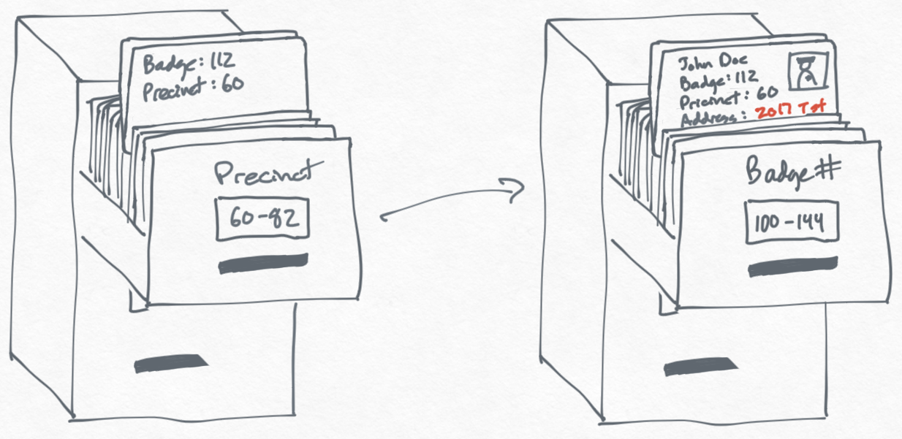
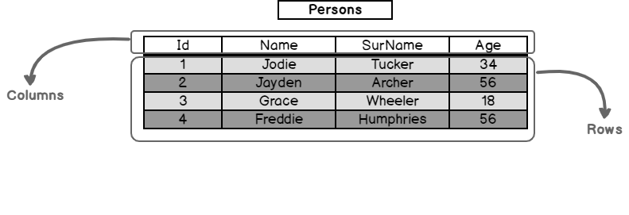
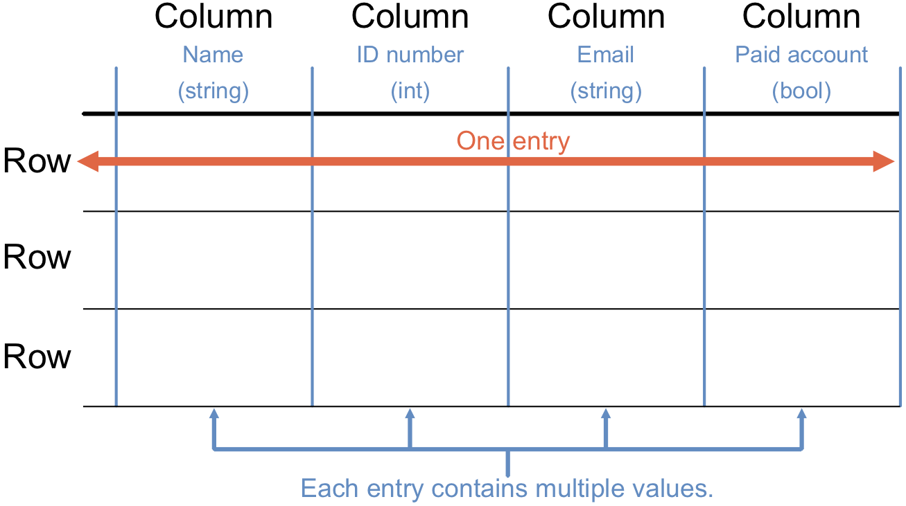
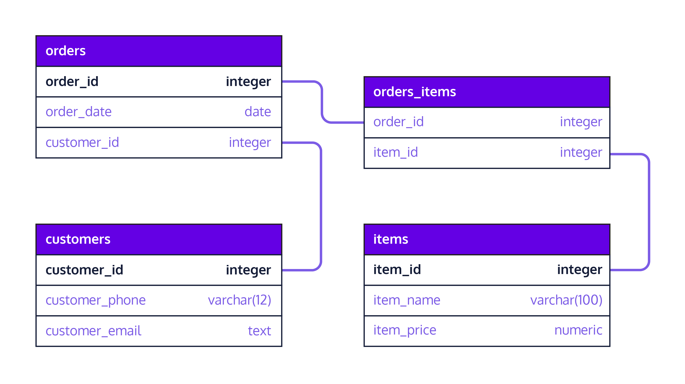

## Introduction to Databases
A **_database_** is like a digital filing cabinet where we store all sorts of information in an organized way, making it easy to find and use when we need it. We need databases because they help us keep track of everything from our shopping lists and favorite songs to important customer information for businesses, making sure nothing gets lost or forgotten.

<aside>

**_Definition..._** 

**_Databases_** are organized collections of data that allow for the efficient storage, retrieval, and manipulation of information. They're like digital filing cabinets where data is stored in a structured way so that it can easily be found and used.
</aside>

<iframe src="https://edpuzzle.com/embed/assignments/66411a415c035b9da587b3c9/watch" title="What are databases" frameborder="0" allow="accelerometer; autoplay; clipboard-write; encrypted-media; gyroscope; picture-in-picture" allowfullscreen style="position: absolute; top: 0; left: 0; width: 100%; height: 100%;"></iframe>

With this little understanding of databases, you might be asking _why do we need databases_? Businesses use databases to manage everything from customer information and inventory levels to employee records and financial transactions. They help in making informed decisions by providing quick access to important data.

<aside>

**_...Think about it...🤔_** 

    Think of a library's catalog system...
    How can it be similar to a database in terms of organizing and finding books?
</aside>

## Types of Databases
While considering a database, we need to first understand the structure of the data we want to store in it. Broadly, most data falls into one of these 3 categories... 
- `structured`
- `semi-structured`
- `unstructured`

Subsequently, the type of data category determines what type of databases will be suitable for our use cases. Generally, databases are of 2 types - _relational_ and _non-relational_.

<aside>

- **Relational Databases**: These databases store data in tables, much like spreadsheets, with rows representing records and columns representing attributes. For example, a databse of customer information with attributes such as _name_, _age_, _purchase history_, etc.

- **Non-Relational Databases (NoSQL)**: These are more flexible databases designed to handle semi-structured and unstructured data like documents, images, and JSON objects. They are best when the data doesn't fit neatly into tables (i.e., rows and columns).
</aside>

<iframe src="https://www.youtube.com/embed/ORxMMo7it_Y?si=rWfKgwb2Acff3Oag" title="Sample Data Science Project" frameborder="0" allow="accelerometer; autoplay; clipboard-write; encrypted-media; gyroscope; picture-in-picture" allowfullscreen style="position: absolute; top: 0; left: 0; width: 100%; height: 100%;"></iframe>

<aside>

**_Check your understanding_...📚** 

For a local grocery store, list what kind of information might be stored in a relational database (e.g., product name) versus what might be better suited for a non-relational database (e.g., images of products).
</aside>

## Database Terminologies
Just like every other tools, there are certain terms or keywords that are associated with databases. To have a decent idea of how databases work, these terms need to be clearly understood. The common ones are given below...

### 1. Tables
Think of a table as a spreadsheet where data about a particular category is stored. For example, a `Person` table might store information about _persons_ as depicted below.

### 2. Rows and Columns
Each row (record) in a table represents a unique piece of data, like a single customer. Columns (fields) represent the attributes of that data, such as name, email, and phone number.

### 3. Schema
A schema is the blueprint of a database that defines how data is organized, including the tables, fields, and relationships between tables. For example, the schema belows defines how 4 different table are organised and linked together. 

<aside>

**_Chapter summary...✍🏾_**

**_Databases_** are organized collections of data that allow for the efficient storage, retrieval, and manipulation of information. They're like digital filing cabinets where data is stored in a structured way so that it can easily be found and used. 

**_Businesses_** use databases to manage everything from customer information and inventory levels to employee records and financial transactions, which helps in making informed decisions by providing quick access to important data.

**_Types of Databases_**
- **Relational Databases**: store data in tables, much like spreadsheets, with rows representing records and columns representing attributes. 

- **Non-Relational Databases (NoSQL)**: flexible databases designed to handle semi-structured and unstructured data like documents, images, and JSON objects. 
</aside>

### 👩🏾‍🎨 **`Practice: Draw your Pets table`**
The following are the TODOs...✍🏾

- Draw a simple table for a `Pets` database.
- Use *pet_id*, *name*, *pet_type* (e.g., dog, cat), and *owner_id* as columns. 
- Use Tldraw or other drawing tools.
- Upload the drawing/sketch to **_Padlet_** below.

<iframe src="https://padlet.com/curriculumpad/design-a-pets-database-zw85tqtscca87egf" title="Sample Data Science Project" frameborder="0" allow="accelerometer; autoplay; clipboard-write; encrypted-media; gyroscope; picture-in-picture" allowfullscreen style="position: absolute; top: 0; left: 0; width: 100%; height: 100%;"></iframe>

<aside>

**➡️ In the next section...**
- We'll look at Structured Query Language (SQL).
</aside>

