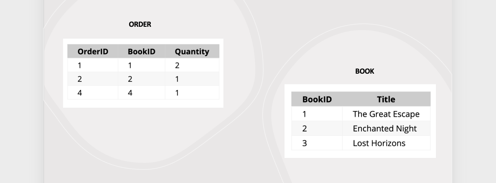

## Combining multiple tables
In our bookstore example, imagine we need to generate reports showing not just what books were sold, but also who bought them and when. We cannot achieve this only by focusing on just one _Books_ table. We'll need to pull data from different tables to answer such complex questions.

<!-- Joining tables thus enables the integration of related data stored in different tables, providing a more holistic view of the bookstore's operations -->


<aside>

**_Definition..._** 

**_JOIN_** merges records from two tables by comparing the values of columns in one table with the values of columns in the other table.
</aside>

<div style="position: relative; padding-bottom: 56.25%; height: 0;"><iframe width="100%" height="415" src="https://www.youtube.com/embed/G3lJAxg1cdfgy8?si=8jtdMo8m3hhdgOBmkb5" title="Linking your CSS" frameborder="0" allow="accelerometer; autoplay; clipboard-write; encrypted-media; gyroscope; picture-in-picture" allowfullscreen></iframe></div>

Joins are crucial in relational databases because they allow for the combination of data from two or more tables based on a related column between them. This is essential for creating comprehensive datasets that can answer complex queries by pulling together relevant information from different tables.

### Types of Joins
There are different ways we can join multiple tables depending on why we need those data in the other columns. For this lesson, we'll be looking at 4 different joins.
1. Inner join
2. Left outer join
3. Right outer join
4. Full outer join

To illustrate how these join work on multiple tables, let's consider two simplified tables from our bookstore database.

<!--  -->

`Books`

| BookID | Title            |
|--------|------------------|
| 1      | The Great Escape |
| 2      | Enchanted Night  |
| 3      | Lost Horizons    |

`Orders`

| OrderID | BookID | Quantity |
|---------|--------|----------|
| 1       | 1      | 2        |
| 2       | 2      | 1        |
| 3       | 3      | 1        |  


<!-- | OrderID | Title            | Quantity |
|---------|------------------|----------|
|       1 | The Great Escape |        2 |
|       2 | Enchanted Night  |        1 |
|       3 | Lost Horizons    |        1 | -->


#### 1. INNER JOIN
This is the most common type of JOIN you'll come across. Inner join combines multiple tables by retrieving records that have matching values in both tables (in the common column).  Following up with our bookstore example, let's look at how we can get data from both `Orders` and `Books` tables.

**SQL Query**:
```sql
SELECT Orders.OrderID, Books.Title, Orders.Quantity
FROM Orders
INNER JOIN Books ON Orders.BookID = Books.BookID;
```

**<a href="https://onecompiler.com/mysql/429ks4tb6" target="_blank"> Try IT! </a>**


**Result**:

| OrderID | Title            | Quantity |
|---------|------------------|----------|
|       1 | The Great Escape |        2 |
|       2 | Enchanted Night  |        1 |
|       3 | Lost Horizons    |        1 |

#### 2. LEFT OUTER JOIN
Also called _LEFT JOIN_, it returns all records from the left table, and the matching records from the right table. For the bookstore database, it'll return all rows from the left table (`Orders`), and the matched rows from the right table (`Books`). If there's no match, the result from the right table is _NULL_.

**SQL Query**:
```sql
SELECT Orders.OrderID, Books.Title, Orders.Quantity
FROM Orders
LEFT OUTER JOIN Books ON Orders.BookID = Books.BookID;
```

**Result**:

| OrderID | Title            | Quantity |
|---------|------------------|----------|
| 1       | The Great Escape | 2        |
| 2       | Enchanted Night  | 1        |
| 4       | NULL             | 1        | 

> No matching _BookID_ in `Books` table for _OrderID_ **4**. Hence, we have a _NULL_ for the title.

#### 3. RIGHT OUTER JOIN
This is the opposite of LEFT JOIN, where it returns all records from the right table, and the matching records from the left table. Using our example, it returns all rows from the right table (Books), and the matched rows from the left table (Orders). If there's no match, the result from the left table is _NULL_.

**SQL Query**:
```sql
SELECT Orders.OrderID, Books.Title, Orders.Quantity
FROM Books
LEFT OUTER JOIN Orders ON Books.BookID = Orders.BookID;
```

**Result**:

| OrderID | Title            | Quantity |
|---------|------------------|----------|
| 1       | The Great Escape | 2        |
| 2       | Enchanted Night  | 1        |
| NULL    | Lost Horizons    | NULL     | Note: No matching OrderID in Orders table


#### 4. FULL OUTER JOIN
Combines the results of both LEFT OUTER JOIN and RIGHT OUTER JOIN. All rows from both tables are returned, with NULL values in places where there is no match.

**SQL Query**:
<!-- *Assuming support for FULL OUTER JOIN, this query combines all previous examples.* -->

**Result**:

| OrderID | Title            | Quantity |
|---------|------------------|----------|
| 1       | The Great Escape | 2        |
| 2       | Enchanted Night  | 1        |
| 4       | NULL             | 1        | <!-- No matching BookID in Books table -->
| NULL    | Lost Horizons    | NULL     | <!-- No matching OrderID in Orders table 


<aside>

**_Chapter summary...✍🏾_**


</aside>


### 👩🏾‍🎨 Practice: Hypothetical Presidential Election

For a presidential election databse, imagine we have two tables: `Candidates` and `Votes`.

**Task**: Using JOIN, write the SQL commands to get an overview of the election results.

`Candidates`

| CandidateID | Name           | Party       |
|-------------|----------------|-------------|
| 1           | Jane K. Doe    | Party A     |
| 2           | John Smith     | Party B     |

`Votes`

| VoteID | CandidateID | Region      | NumberOfVotes |
|--------|-------------|-------------|---------------|
| 1      | 1           | North       | 5000          |
| 2      | 2           | South       | 4000          |
| 3      | 1           | East        | 6000          |
| 4      | 2           | West        | 3000          |


<!-- SOLUTION:

```sql
SELECT Candidates.Name, SUM(Votes.NumberOfVotes) AS TotalVotes
FROM Candidates
INNER JOIN Votes ON Candidates.CandidateID = Votes.CandidateID
GROUP BY Candidates.Name;
``` 
-->


<aside>

**➡️ In the next section...**
- We'll look at different SQL functions.
</aside>