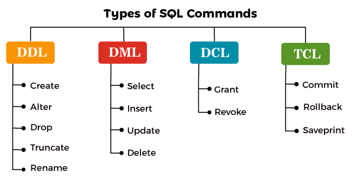

# Data Management with SQL
To manage the data in a database, we need an _SQL Query_, which are instructions you give to a database to perform specific actions, such as retrieving data, updating records, or creating new database and tables. Think of them as commands or requests to access and manipulate the data stored in your database in various ways.

<aside>

**_Definition..._** 

**_SQL Query_** is a request made to a database to perform a specific action on the data it contains. This action can range from retrieving data, inserting new records, updating existing data, or deleting records.
</aside>

<div style="position: relative; padding-bottom: 56.25%; height: 0;"><iframe src="https://www.youtube.com/embed/wmiDdBG-yP4?si=Z-nD8ZGZXabOKLqm" title="SQL Fundamentals" frameBorder="1" allow="accelerometer; autoplay; clipboard-write; encrypted-media; gyroscope; picture-in-picture" allowfullscreen style="position: absolute; top: 0; left: 0; width: 100%; height: 100%;"></iframe></div>

In summary, we now understand the following about SQL.
- SQL interacts with databases using relational database management systems (RDBMS), such as MySQL.
- W have seen how to download and install `MySQL`, a popular and free RDBMS.
- Using _MySQL Workbench_, we can create a database, import data, and execute SQL queries to analyze the data.
- We have also seen SQL operations like SELECT, filtering, aggregate functions, and exporting data to Excel or PowerBI.

Now, let's look at some of the above points in details. Since SQL queries are written to manage and manipulate relational databases, a simple SQL query typically follows this basic structure:

1. **SELECT**: This is a clause that specifies the columns to be returned in the query result.
2. **FROM**: This is a clause that indicates the table from where to retrieve the data.
3. **WHERE** (optional): This is a clause that sets conditions for selecting rows. Only rows that meet the condition will be included in the result.
4. **ORDER BY** (optional): This is a clause that specifies the order in which to return the rows, based on one or more columns.

To further undertand the structure of a query, imagine you have a database for a bookstore and you want to find the titles and prices of all books in the "_Fantasy_" genre that are priced under _$20_, ordered by their _publication date_. The SQL query for this request would look something like this:

```sql
SELECT Title, Price, Me
FROM Books
WHERE Genre = 'Fantasy' AND Price < 20
ORDER BY PublishDate DESC;
```


In the above query, here is a breakdown of the query...
- The **SELECT** clause selects the `Title` and `Price` columns.
- The **FROM** clause specifies that the data comes from the `Books` table.
- The **WHERE** clause filters the rows to include only those where the `Genre` is 'Fantasy' and the `Price` is less than _$20_.
- The **ORDER BY** clause orders the results by `PublishDate` in descending order (`DESC`), meaning the most recently published books appear first.

Next, we need to look at different SQL commands in detail to have a better understanding of how it works behind the scene using a sample scenario of a book store.

<!-- <div style="position: relative; padding-bottom: 56.25%; height: 0;"><iframe width="100%" height="415" src="https://www.youtube.com/embed/1GhghjgJTuanORg0" title="Linking your CSS" frameBorder="1" allow="accelerometer; autoplay; clipboard-write; encrypted-media; gyroscope; picture-in-picture" allowfullscreen></iframe></div> -->

## Basic SQL Commands
Just like evry other standard language, SQL has its syntax which must adhere to before we can use it. Generally, SQL commands can be broadly categorized into _Data Definition Language_ (DDL) and _Data Manipulation Language_ (DML), _Data Control Language_ (DCL), and _Transaction Control Language_ (TCL). For this lesson, we'll on only focus on DDL and DML.


  
### Data Definition Language (DDL)
DDL are set of commands that deals with the schema and structure of a database. These commands are used to create, alter, and delete databases and their objects like tables and indexes. The key operations performed by DDL commands include:

#### <ins>1. CREATE </ins>
This command is used to create new tables, databases, and other database objects. Let's look at a use case scenario.

**Use case**: A new online bookstore wants to manage information about its books and customers. They decided to start by creating two tables - one for Books and another for Customers. The `CREATE TABLE` statement can be used to establish these table structure in the database with appropriate columns for storing book details (like _title, author_, and _price_) and customer information (such as _name, email_, and _purchase history_).
  
<iframe
 frameBorder="1"
 height="400px"  src="https://onecompiler.com/embed/mysql/429kcxdy2" 
 width="100%">
</iframe>

`NOTE: Running the code above will not output or display anything`

#### <ins>2. ALTER</ins>
Modifies the structure of existing database objects, for example, adding or removing columns from a table. 

**Use case**: After a few months of operations, the bookstore realizes that they need to track each book's _genre_ to make recommendations to customers. They decide to add a _Genre_ column to the Books table. The `ALTER` command is used to modify the Books table to include this new column without losing any existing data.

<iframe
 frameBorder="1"
 height="400px"  src="https://onecompiler.com/embed/mysql/429kh4j6x" 
 width="100%">
</iframe>

#### <ins>3. DROP</ins>
This deletes databases, tables, or other objects completely from the database. 

**Use case**: The bookstore initially created a temporary table named _TempSales_ to experiment with a new sales tracking approach. After developing a more robust system integrated with their main sales database, the temporary table is no longer needed. The `DROP` command is used to delete the TempSales table and all its contents from the database, freeing up space and resources.

  ```sql
  DROP TABLE TempSales;
  ```

#### <ins>4. TRUNCATE</ins>
We can use `TRUNCATE` to reset a table by removing all its data while retaining the table's structure, making it ready for new data without the need to recreate the table schema.

**Use case**: The online bookstore runs a monthly promotion where they temporarily store promotional data in a table called MonthlyDeals. At the beginning of each new month, they need to clear this table to make room for the new month's promotions without removing the table structure itself, as it will be reused. The `TRUNCATE` command is perfect for this scenario because it quickly deletes all records from the MonthlyDeals table, but keeps the table available for the next set of data.

```sql
TRUNCATE TABLE MonthlyDeals;
```

<aside>

**DDL summary...** 
- DDL commands do not manipulate or interact with the data itself but rather define how the database, tables, and other objects are structured. 

- Changes made by DDL commands are usually permanent and can significantly alter the database's organization.
</aside>

### Data Manipulation Language (DML)
DML commands are used for managing data within tables, which allow us to insert, update, delete, and retrieve data from a database. Unlike the DDL, the primary focus of DML is on the manipulation of data rather than the structure of the database. The key operations performed by DDL commands include:

- **SELECT**: Retrieves data from one or more tables and is the most widely used DML command.
- **INSERT**: Adds new rows (records) to a table.
- **UPDATE**: Modifies existing data within a table.
- **DELETE**: Removes rows from a table.

Unlike _DDL_ commands, _DML_ operations can be rolled back (undone) if the database is using `TRANSACTION` control. However, using `TRANSACTION` is out of scope for this lesson. Now let's look at these DML commands in detail while continuing with the bookstore scenario.

#### <ins>1. SELECT</ins>
This retrieves specific data from one or more tables, allowing for conditions to specify exactly which records to return.

**Use case**: To analyze sales trends, the online bookstore wants to create a report of _all books in the "Fantasy" genre published after January 1, 2015,_ . Here, we can use the `SELECT` statement to query the Books table by retrieving titles and publication dates that match these criteria.

<iframe
 frameBorder="1"
 height="400px"  src="https://onecompiler.com/embed/mysql/429khv9yb" 
 width="100%"
 ></iframe>


#### <ins>2. INSERT</ins>
Adds new records to a table by specifying values for each column in the new row.

**Use case**: A customer purchases a new title from the online bookstore, "_The Lost Kingdom_" by _Jane Smith, priced at _$12.50_ in the "Adventure" genre. The bookstore uses the `INSERT` statement to add this book and many others to the Books table.

<iframe
 frameBorder="1"
 height="400px"  src="https://onecompiler.com/embed/mysql/429kkfpzu" 
 width="100%">
</iframe>

#### <ins>3. UPDATE</ins>
This command modifies existing records in a table based on specified criteria, by allowing for one or more columns to be updated.

**Use case**: After a pricing review, the bookstore decides to reduce the price of "_The Enchanted Forest_" by _$2_. Here, the `UPDATE` statement is used to adjust the _Price_ column in the _Books_ table for this title.

<iframe
 frameBorder="1"
 height="400px"  src="https://onecompiler.com/embed/mysql/429kktgg2" 
 width="100%">
</iframe>


#### <ins>4. DELETE</ins>
It removes records from a table that match **specified criteria** by effectively deleting the data from the database.

**Use case**: The bookstore decides to discontinue selling a poorly reviewed book titled "_Mystic River_" that hasn't sold any copies. here, we can use the `DELETE` statement to remove all records of this book from the _Books_ table.

<iframe
 frameBorder="1"
 height="400px"  src="https://onecompiler.com/embed/mysql/429km6vx3" 
 width="100%">
</iframe>


### Data Types
Understanding SQL data types is crucial for defining the type of data that can be stored in each column of a table. These data types help ensure that the data stored in a database is _accurate_, _consistent_, and in a format that can be effectively used for analysis. Using the bookstore example, you'll notice the use of `INTEGER` and `VARCHAR` in the previous SQL commands. Let's look at what they actually indicate.
- **INTEGER**: A whole number. For example, in our bookstore database, the `BookID` column uses the INTEGER data type to store unique identification numbers for each book.
- **VARCHAR**: A variable-length string. This is used for text or characters of varying length. In the bookstore example, the `Title` and `Author` columns might use the VARCHAR data type to store book titles and author names, respectively, since these can vary in length.
- **DATE**: A calendar date (year, month, day). This type is used for dates, allowing the database to store information in a date format. In our bookstore database, the `PublishDate` column uses the DATE data type to store the release dates of books.

<aside>

**_Chapter summary...✍🏾_**

**_SQL Query_** is a request made to a database to perform a specific action on the data it contains. A simple SQL query typically follows this basic structure:
- **SELECT**
- **FROM**
- **WHERE** (optional)
- **ORDER BY** (optional)

**Basic SQL Commands** can be broadly categorized into...
- **DML** commands are used for managing data within tables.
- **DDL** are set of commands that deals with the schema and structure of a database. 

**Data Types** define the type of data that can be stored in each column of a table and ensure that the data stored in a database is _accurate_, _consistent_.
- **INTEGER**: A whole number. 
- **VARCHAR**: A variable-length string.
</aside>

### 👩🏾‍🎨 **`Practice: SQL Playground...`**
Using the _SQL_ editor below, write a series of SQL command to...✍🏾 

- Create atleast 2 different tables in the databse.
- Add at least 4 columns with appropriate data types in each table.
- Modify the tables by adding an additional column.
- Insert minimum of 4 records in each table.
- Delete one record each from each table

<!-- #### Submission
- Practice using the editor below.
<!-- - Copy all your SQL queries
- Submit your SQL queries using **[this repl](https://replit.com/team/tk11-ids/Practice-Data-management)**. -->

<iframe
 frameBorder="1"
 height="300px"  src="https://onecompiler.com/embed/mysql/42cvvbnzg" 
 width="100%"
 ></iframe>


<aside>

**➡️ In the next section...**
- We'll look at joining multiple tables within a database.
</aside>

<!-- 
### Live class

In a live class, we'll design a database schema for a simple application (like a to-do list or a small online store). -->
