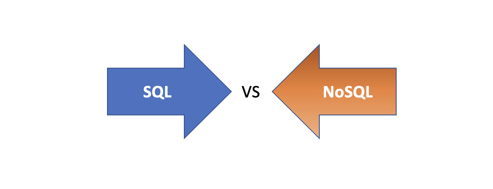

# Fundamentals of SQL

SQL, or Structured Query Language, was created in 1970 to interact with databases. SQL is pronounced `sequel` or sometimes `ess-queue-ell`, and was initially known as the structured English query language (SEQUEL). 

<aside>

**_Definition..._** 

**_SQL_** is a standard language used for storing, updating, removing, searching, and retrieving information from a database.
</aside>

<iframe src="https://www.youtube.com/embed/27axs9dO7AE?si=xM1ApBJMh-kSLqmj" title="What are databases" frameborder="0" allow="accelerometer; autoplay; clipboard-write; encrypted-media; gyroscope; picture-in-picture" allowfullscreen style="position: absolute; top: 0; left: 0; width: 100%; height: 100%;"></iframe>

Over the years, SQL became a standard way to query and manipulate several databases. Hence, making it possible to use SQL across different _database systems_. Database systems or Database Management System (DBMS) is a piece of software that uses SQL behind the scenes to manage the data in a database.

Example DBMS are _Oracle_, _Postgres_, SQL Server, and _MySQL_. Using SQL with different DBMS might be slightly different in a few cases, however, it follows the same syntax for most. A typical workflow of DBMS being used to manage _customer orders_ is shown below.

<!--  -->

## SQL for Businesses

SQL is now everywhere - from small businesses managing customer databases to global companies analyzing vast amounts of data. Its standardization and reliability have made it a foundational tool in data management and analysis. 

 

<iframe src="https://www.youtube.com/embed/wmiDidBG-yP4?si=Z-nD8ZGZXabOKLqm" title="What are databases" frameborder="0" allow="accelerometer; autoplay; clipboard-write; encrypted-media; gyroscope; picture-in-picture" allowfullscreen style="position: absolute; top: 0; left: 0; width: 100%; height: 100%;"></iframe>

<aside>

**_...Think about it...🤔_** 

    - Look up one local and one global company...
    - What kinds of data do you think these companies are managing with SQL?
</aside>

## SQL vs NoSQL
To choose the right type of database, we need to look at both the relationship between the data point and the structure of the whole data. For _SQL_ databases, they organize data into well-defined tables and relationships, like a neatly arranged photo album, making them great for structured data that fits into a fixed format.

However, _NoSQL_ databases offer a more flexible and scalabale approach, where data can be stored in various ways without a predefined structure. This is ideal for handling a wide range and scale of data types and relationships. Now, let's look at how these two database types differ based on structure, queries, and use cases.

<aside>

**_SQL vs NoSQL_...**
- **Structured vs. Unstructured Data**: SQL databases are ideal for structured data, which follows a specific format and organization (like tables with rows and columns). NoSQL databases, on the other hand, are designed for unstructured or semi-structured data such as documents, social media posts, or JSON objects.

- **Complex Queries**: SQL databases excel at complex queries involving multiple tables and detailed conditions. NoSQL is optimized for quick data retrieval and scalability in applications where the data structure may change over time.

- **Use Cases**: SQL is preferred for scenarios requiring complex joins, transactions, and precise data integrity (e.g., financial records, customer relationship management). NoSQL suits applications needing to store large volumes of data that don't fit neatly into tables (e.g., big data applications, real-time web apps).
</aside>

Now that we have an idea of what SQL is and why we need it, we can then dive into writing SQL statements to define and manipulate our datases. 

> **`NOTE!`**: In subsequent lessons, we'll only focus on SQL usage in a relational database context.

<!-- <aside>

**_Chapter summary...✍🏾_**

**_SQL_** is a standard language used for storing, updating, removing, searching, and retrieving information from a database.
</aside> -->
 
</aside>

### 👩🏾‍🎨 **`Practice: Database selection`**
The following are the TODOs...✍🏾

- Assume you have a bookstore and needs to annalyse the sales across multiple cities.
- What type of database will be well-suited to your analysis? SQL or NoSQL?
- Justify your answer

<!-- ### LIVE CLASS
- **Group Discussion**: Assign a few common applications (e.g., online banking, e-commerce websites, social media platforms) and have groups discuss whether they would use SQL or NoSQL to manage the data, encouraging them to justify their choices. -->

