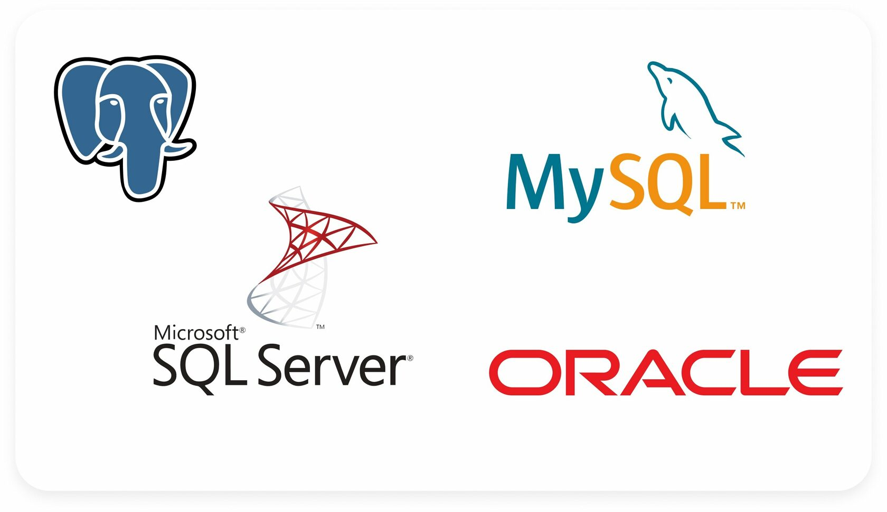
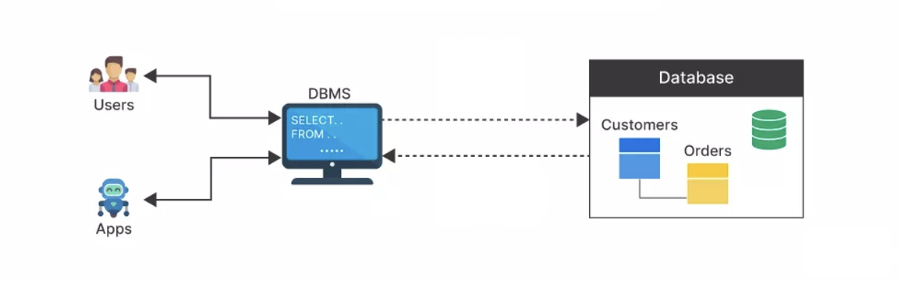

## Fundamentals of SQL

SQL, or Structured Query Language, was created in 1970 to interact with databases. SQL is pronounced `sequel` or sometimes `ess-queue-ell`, and was initially known as the structured English query language (SEQUEL). Overtime, it became a standard way to query and manipulate several databases. Hence, making it possible to use SQL across different _database systems_.

Database systems or Database Management System (DBMS) is a piece of software that uses SQL behind the scenes to manage the data in a database. Example DBMS are _Oracle_, _Postgres_, and _MySQL_. Using SQL with different DBMS might be slightly different in few cases, however, it follows the same syntax in most cases.

<!-- <aside>

**_Definition..._** 

**_SQL_**, is a standard language used for storing, updating, removing, searching, and retrieving information from a database.
</aside> -->

SQL is now everywhere - from small businesses managing customer databases to global companies analyzing vast amounts of data. Its standardization and reliability have made it a foundational tool in data management and analysis. A typical workflow of SQL being used to manage _customer orders_ is shown below.

<aside>

**_...Think about it...🤔_** 

    - Look up one local and one global company...
    - What kinds of data do you think these companies are managing with SQL?
</aside>

<!-- ### Advantages of using SQL
- **Ease of Use**: SQL's syntax is similar to English, making it accessible for beginners to learn and understand. It allows for straightforward querying, updating, and managing of data in a database.
- **Flexibility and Power**: SQL can handle complex queries, manage large volumes of data, and perform various operations like data insertion, update, deletion, and searching. This makes it invaluable for making informed business decisions.
- **Versatility**: From finance to healthcare, nearly every industry relies on SQL for data analysis, reporting, and data management, showcasing its utility in a wide range of applications. -->

<!-- ### SQL vs. NoSQL Overview
- **Structured vs. Unstructured Data**: SQL databases are ideal for structured data, which follows a specific format and organization (like tables with rows and columns). NoSQL databases, on the other hand, are designed for unstructured or semi-structured data such as documents, social media posts, or JSON objects.
- **Complex Queries**: SQL databases excel at complex queries involving multiple tables and detailed conditions. NoSQL is optimized for quick data retrieval and scalability in applications where the data structure may change over time.
- **Use Cases**: SQL is preferred for scenarios requiring complex joins, transactions, and precise data integrity (e.g., financial records, customer relationship management). NoSQL suits applications needing to store large volumes of data that don't fit neatly into tables (e.g., big data applications, real-time web apps).

**Simple Practice**: Present a scenario, like a bookstore wanting to analyze their sales data across multiple cities and ask students to argue whether SQL or NoSQL would be better suited for this task.

### Checking Student Understanding
- **Group Discussion**: Assign a few common applications (e.g., online banking, e-commerce websites, social media platforms) and have groups discuss whether they would use SQL or NoSQL to manage the data, encouraging them to justify their choices.
- **Quiz**: Prepare a short quiz covering the history and relevance of SQL, its advantages, and the distinctions between SQL and NoSQL databases.
- **Practical Exercise**: Provide a set of data in a table format and a few simple queries (e.g., SELECT, INSERT) for students to practice writing and executing in an SQL environment. This can be done using online SQL playgrounds or simulators.

This lesson aims to introduce students to SQL's foundational concepts, emphasizing its history, advantages, and practical applications. By using relatable examples and interactive exercises, students with no previous knowledge can grasp how SQL plays a crucial role in data management and analysis across various industries. -->