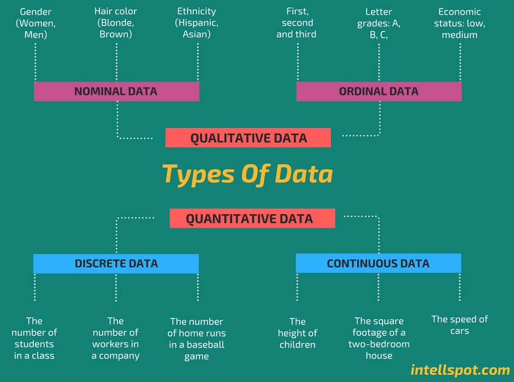

# Data and Data Categories

## What is data

<aside>

**_Definition_**

Data is any information that is collected, stored, and analyzed to generate insights and inform decision-making.

</aside>

<iframe src="https://www.youtube.com/embed/2X9pv7FUrOk" title="Sample Data Science Project" frameborder="0" allow="accelerometer; autoplay; clipboard-write; encrypted-media; gyroscope; picture-in-picture" allowfullscreen style="position: absolute; top: 0; left: 0; width: 100%; height: 100%;"></iframe>

Data is increasing rapidly due to several factors... 
- rise of digital technologies 
- growing use of the internet and social media 
- increasing number of devices and sensors that generate data. 

In fact, it is estimated that the amount of data generated worldwide will reach 180 zettabytes by 2025, up from just 4.4 zettabytes in 2013. This explosion of data presents both opportunities and challenges for data scientists, who must find ways to extract insights and value from this vast and complex data landscape.

### Power of data

<aside>

📺 Here's is Microsoft CEO's view on data as the new electricity 

</aside>

<iframe src="https://www.youtube.com/embed/VIAFQ5p2dxU?start=39" title="Sample Data Science Project" frameborder="0" allow="accelerometer; autoplay; clipboard-write; encrypted-media; gyroscope; picture-in-picture" allowfullscreen style="position: absolute; top: 0; left: 0; width: 100%; height: 100%;"></iframe>

## Data Categories
In its raw form, _data_ can be categorized into **qualitative** and **quantitative** types based on their characteristics and attributes. Each of this type can further be broken as _nominal, ordinal, discrete_, and _continuous_.

- Quantitative data refers to numerical or measurable data that can be expressed in terms of numbers, such as height, weight, temperature, and sales figures. 

- Qualitative data, on the other hand, refers to non-numerical data that cannot be expressed in terms of numbers, such as opinions, attitudes, and beliefs.

## Data Exploration

| Email                          | Total Score | Max Points | Status | Submission ID | Submission Time           | Lateness (H:M:S) |
|--------------------------------|-------------|------------|--------|---------------|---------------------------|------------------|
| abdulafeez.adeyemo@kibo.school | 50          | 100        | Graded | 154948946     | 2022-12-19 23:37:22 -0500 | 00:00:00         |
| labake@kibo.school             | 100         | 100        | Graded | 154948947     | 2022-12-19 23:37:22 -0500 | 00:00:00         |
| samuel.adeyemi@kibo.school     | 50          | 100        | Graded | 154948948     | 2022-12-19 23:37:22 -0500 | 00:00:00         |
| aisha.daodu@kibo.school        | 25          | 100        | Graded | 154948949     | 2022-12-19 23:37:22 -0500 | 00:00:00         |
| christopher.alade@kibo.school  | 75          | 100        | Graded | 154948950     | 2022-12-19 23:37:22 -0500 | 00:00:00         |
| alvin.tagoe@kibo.school        | 50          | 100        | Graded | 154948951     | 2022-12-19 23:37:22 -0500 | 00:00:00         |

<!-- 
- **Numerical Data**: This includes any data that can be represented by numbers, such as height, weight, temperature, or time.

- **Categorical Data**: This includes data that falls into categories or groups, such as gender, race, or occupation.

- **Text Data**: This includes any data in the form of written or spoken language, such as customer reviews, social media posts, or news articles.

- **Time Series Data**: This includes data that is collected over time, such as stock prices, weather patterns, or website traffic.

- **Spatial Data**: This includes data that is associated with a specific location or geographic area, such as GPS coordinates or city population.

- **Image and Video Data**: This includes any data in the form of digital images or videos, such as satellite imagery, medical scans, or security footage.

- **Graph and Network Data**: This includes data that is organized in the form of nodes and edges, such as social networks or transportation networks.

- **Sensor Data**: This includes data collected from sensors, such as temperature sensors, pressure sensors, or motion sensors.

- **Transactional Data**: This includes data associated with business transactions, such as sales data, customer orders, or financial transactions.
 -->

<!-- > 👉🏾 In the next section, we'll look at the role of data in decision-making, and understand different data categories. -->
