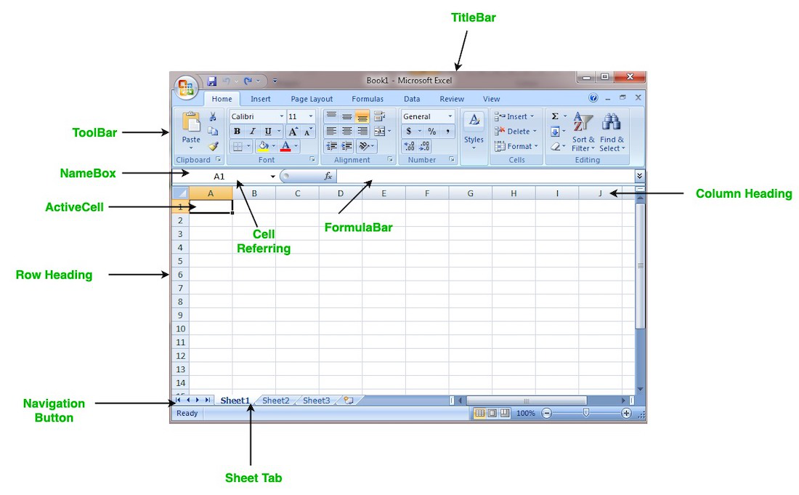

# 🔢 Data and Spreadsheets
As a multidisciplinary field, data science uses myriads of tools for different tasks within the phases of the data science workflow, and we'll explore some of these tools in this course. In this section, we'll start by looking at spreadsheets, and further explore a popular spreadsheet software - _Microsoft Excel_. To start with, let understand what we mean by _spreadsheets_ and why we need them as data scientist. 

## What are spreadsheets?
**Spreadsheets** are softwares that allows a user to capture, organize, and manipulate data represeted in `rows` and `columns`. They are often designed to hold **numeric** and **short text** data types. Today, there are many spreadsheet programs out there which can be used locally on your PC or online through your browsers. They provide different features to ease data manipulation as shown below.

 </img>

### Benefits of spreadsheets
- **Ease of use** - Spreadsheets are widely used and familiar to many people, making them easy to use.
- **Data organization** - Spreadsheets provide a structured way to organize data, making it easier to sort, filter, and analyze datasets.
- **Data analysis** - Spreadsheets provide a range of functions and formulas that allow for basic data analysis, such as summing, averaging, and finding min/max values.
- **Collaboration** - Spreadsheets can be easily shared and edited by multiple users, making them a useful tool for collaboration and teamwork.
- **Cost-effective** - Many spreadsheet programs are available for free or at a low cost, making them an affordable option for data analysis.

Overall, spreadsheets are a useful tool for data science tasks, particularly for tasks that involve organizing, manipulating, and analyzing data on a smaller scale. However, for more complex data analysis tasks or larger datasets, specialized software tools and/or programming languages may be required.

#### How can i use spreadsheet?
Popular spreadsheet softwares currently available includes Microsoft Excel, Apple Numbers, LibreOffice, OpenOffice, Smartsheet, and Zoho Sheet among others. However, Microsoft Excel is the most popular within the data science communities. For this week, we'll be using Microsoft Excel. 

<aside>

**_Microsoft Excel..._**

Microsoft Excel allows you to create, organize, and manipulate your data in rows and columns while collaborating with others. It is one of the most popular spreadsheet software currently in the market.

To have a general background on how Microsoft Excel works and the features therein 
- Watch the next video 📺. 
- Pause and practice along with the tutor.

</aside>

<iframe src="https://www.youtube.com/embed/e7xGuGqgp-Q" title="Sample Data Science Project" frameborder="0" allow="accelerometer; autoplay; clipboard-write; encrypted-media; gyroscope; picture-in-picture" allowfullscreen style="position: absolute; top: 0; left: 0; width: 100%; height: 100%; border: 1px solid grey;"></iframe>

#### **A brief recap of Microsoft Excel...**
- Microsoft Excel is a free spreadsheet program create by `Microsoft`.
- By default, it comes pre-installed as part of your operating system.
- To create a new sheet, launch your Excel app locally or use Office365.
    - select a blank workbook or use prdefined templates.
- Enter your data in rows and columns across the worksheet.
- Microsoft Excel app doesn't automatically save your work, unless you configure it to do so.
- There are predefined `built-in` functions to help you with basic and complex arithmetics. Some basic ones are;
    - **AVG** - finds the average of a range of cells
    - **SUM** - adds up a range of cells
    - **MIN** - finds the minimum of a range of cells
    - **MAX** - finds the maximum of a range of cells
    - **COUNT** - counts the values in a range of cells

Next, we'll explore a sample dataset using Microsoft Excel. As we've learnt in the previous video, you can have more than one `worksheet` in a workbook. In this sample dataset, we have 3 worksheets with different dataset. 
- **corona_virus** - official daily counts of COVID-19 cases, deaths and vaccine utilisation.
- **movies** - contains information about movies, including their names, release dates, user ratings, genres, overviews, and others.
- **emissions** - contains information about methane gas emissions globally.

> **[Data playground - practice dataset](https://docs.google.com/spreadsheets/d/1skQFAP9whhf9di2ncRxwZalgLPGF6Lrqxa8Jfi0njXQ/edit?usp=sharing)**

<aside>

### 👩🏾‍🎨 Practice: Data playground... 🎯
1. Create a copy of this **[dataset](https://docs.google.com/spreadsheets/d/1skQFAP9whhf9di2ncRxwZalgLPGF6Lrqxa8Jfi0njXQ/edit?usp=sharing)** for your own use. 
2. Explore each worksheet to have a sense of what the dataset represent.
3. Attempt the following questions.
    - Which country 🏳️ has the highest number of `active` COVID-19 cases?
    - Which movie 🎞️ has the `lowest` budget?
    - What is the total `emmisions` 🌅 globally?
    - Try to change the 🔴 colour of each workbook.

**Note:** Remember to use the built-in functions where neccessary.

</aside>

> ➡️ In the next section, we'll introduce you to `data cleaning` 🎯.
