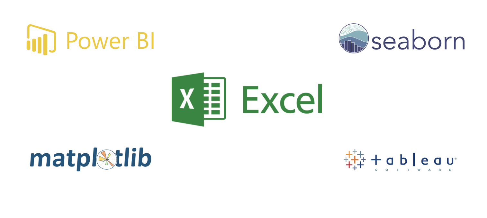

# Data visualization
Rather than looking at rows and columns of numbers or text, imagine using colors, shapes, and patterns to represent information in a visual way. This makes it much simpler for our brains to process and interpret the data, thereby helping us understand information and data more easily. With visualizations, we can see trends, patterns, and relationships that might not be apparent in raw data. _Then how can we visualize our data?_

## Visualization tools
Data visualization tools are software programs that we can use to create visual representations of data in an easy and interactive way. They provide a user-friendly interface where we can input our data and choose from various charts, graphs, and other visual elements to display the information visually. For instance, Google Sheet allows us to create simple charts and graphs directly from spreadsheet data.

Looker studio, Power BI, Tableau, Seaborn, and Matplotlib are more advanced tools that offer a wider range of customization options and advanced visualization techniques. For example, Looker and Power BI allow us to create interactive dashboards and explore data from multiple perspectives. Seaborn and Matplotlib are Python libraries that provide extensive options for creating complex and aesthetically pleasing visualizations. In this lesson, you'll only learn data visualization using Google Sheet. Looker studio will be explored in week 3.

### Visualization with Google Sheet
Data visualization using Google Sheet allows us to present data in a visual and easy-to-understand way, even for people without technical expertise. Imagine you have a spreadsheet full of numbers and information. With Google Sheet's charting and graphing features, you can transform those numbers into colorful and meaningful visual representations. For example, you can create `bar charts` to compare different categories, `line graphs` to track trends over time, or `pie charts` to show proportions. These visualizations help us see patterns, relationships, and insights that might be hidden in rows and columns of data. 

<aside>

To have a good understanding of how to visualize data using Microsoft Excel... 
- Watch the next video 📺.  
- Pause and practice along with the tutor.
</aside>

<iframe src="https://www.youtube.com/embed/B5_gRGEsD2Q?si=cK2JgsWK_lUZXgSB" title="Data visualization with google sheet" frameborder="0" allow="accelerometer; autoplay; clipboard-write; encrypted-media; gyroscope; picture-in-picture" allowfullscreen style="position: absolute; top: 0; left: 0; width: 100%; height: 100%; border: 1px solid grey;"></iframe>

<aside>

**A brief recap on visualization using google sheet...**
- Visual charts are essential for understanding data quickly and are useful for reports, presentations, and budget spreadsheets.
- Google Sheets offers a variety of chart options from `pie charts` to `line charts` for data visualization.
- To create a chart in Google Sheets...
    - select the data range including headings.
    - click `Insert` then choose **_Chart_** 
    - Google sheet automatically generates a chart, which can be customized by changing the chart type, resizing, and renaming.
- More complex charts related to budgeting can be created by exporting data from other spreadsheets. 
- Charts can be customized to show expenses by category using pie charts or compare expenses and income over time using line charts.
- Charts condense large amounts of data into an easy-to-understand format, making them essential for budget monitoring, cash flow analysis, and presentations. 
</aside>

By presenting information visually, Google sheet makes it easier for us to grasp and interpret the data, enabling better decision-making and communication. Visualizations also make it easier to share and communicate information with others, as it provides a clear and intuitive way to present complex data. Whether it's in business, science, or everyday life, data visualization helps us make better decisions and gain insights from the vast amounts of information around us.

<aside>

**_Chapter summary...✍🏾_**

_Data visualization_ is the practice of representing data in a visual format, such as charts, graphs, and maps, to communicate information and insights effectively. It helps us understand complex data by presenting it in a visually appealing and intuitive way. 

By using colors, shapes, and patterns, data visualization allows us to identify patterns, trends, and relationships that may not be apparent in raw data.Tools such as Google Sheet, Looker, Power BI, and Tableau makes it possible for anyone, even with limited technical expertise, to transform data into visual representations that reveal insights and tell compelling stories.

</aside>

### 👩🏾‍🎨 Practice: 
<!-- Using the COVID-19 dataset you cleaned in the last practice exercise, create visualizations that provides information about the COVID-19 pandemic.
1. Explore the dataset to have a sense of what it represent.
2. Create visuals as you deemed fit. No answer is wrong!
3. Share your visualization using **[this padlet](https://padlet.com/curriculumpad/covid-19-visualization-khrajjuimxmd7ynx)**.
    - You can like other cool visuals on the padlet as well. -->

</aside>

 

> 👉🏾 Next, we'll explore some common tools in data science.
