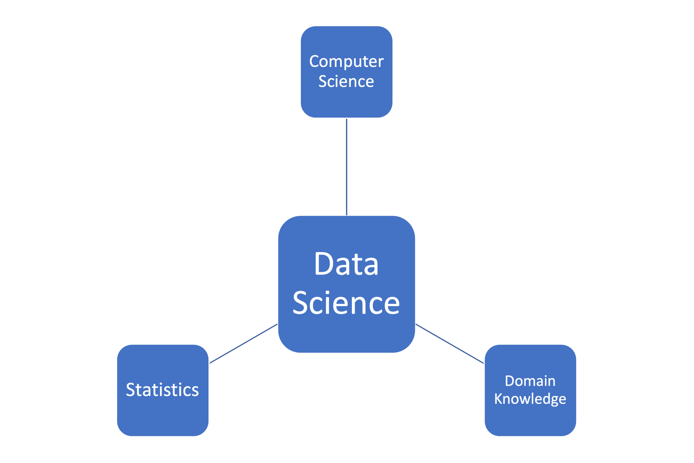
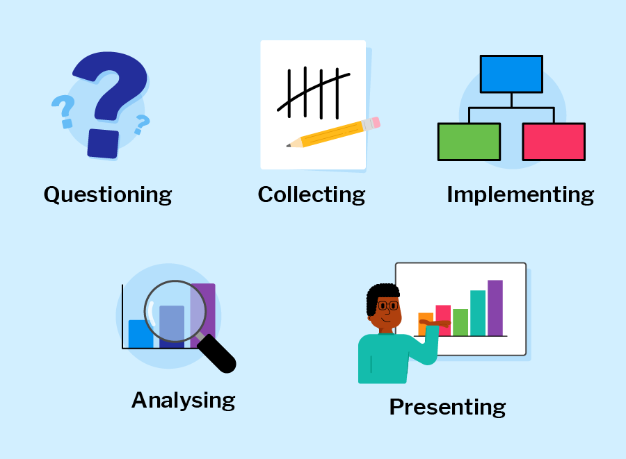
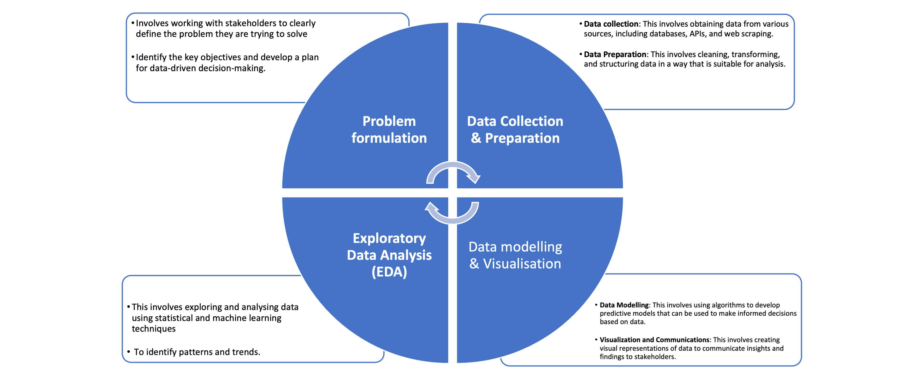

# 🛃 Building blocks and Workflow

## Building blocks
Previously, we described data science as a multidisciplinary field. At the high level, data science is typically an intersection of 3 core areas - _statistics, computer science_, and _domain knowledge. Altogether, these three areas form the building blocks of data science, allowing practitioners to collect, process, analyze, and visualize data in a way that generates valuable insights and informs decision-making processes in various industries and domains.

...statistics, computer science, and domain knowledge are all essential components of data science, and each plays a critical role in the data science process as highlighted below.

<aside>

- **`Computer Science`** - provides the computational and programming tools needed to manipulate, process, and visualize data at scale, such as tools and infrastructure necessary to work with data at scale. This includes programming languages like Python and R, as well as tools like SQL, Hadoop, and Spark.

- **`Statistics`** - provides the foundational concepts and methods for collecting, analyzing, and interpreting data. This is essential for understanding the data itself, including identifying patterns, testing hypotheses, and making predictions. 

- **`Domain Expertise`** - refers to expertise in a specific field or industry, which is critical for understanding the context of the data being analyzed and generating insights that are relevant and useful.  Domain knowledge is particularly important in fields like healthcare, finance, and engineering, where specialized knowledge is required to make informed decisions based on data.
</aside>

In summary, data science building blocks are an intersection of statistical methods, computer science tools, and domain knowledge, which are used together to extract insights and generate value from data. Now, how does a typical data science project looks like?

## Data science workflow

<aside>

_**Definition**_...

Data science workflow includes the standard and well-defined phases a data science project undergoes throughout it entire lifecycle. 

</aside>

Each phase includes different dependent tasks and activities needed to achieve the overall goal of the project. Overall, the workflow serve as guidelines throughout the project life cycle. A typical end-to-end journey of a sample data science project using this workflow is explained in the next video. 

<aside>

📺 Workflow - an end-to-end journey of a data science project 👨🏾‍💻

</aside>

<iframe src="https://www.youtube.com/embed/X3paOmcrTjQ?start=10" title="Sample Data Science Project" frameborder="0" allow="accelerometer; autoplay; clipboard-write; encrypted-media; gyroscope; picture-in-picture" allowfullscreen style="position: absolute; top: 0; left: 0; width: 100%; height: 100%;"></iframe>

<aside>

**In summary, a typical data science project workflows can be summarised below...**

- **`Problem formulation`**: involves work with stakeholders to clearly define the problem they are trying to solve, identify the key objectives, and develop a plan for data-driven decision-making.

- **`Data collection`**: This involves obtaining data from various sources, including databases, APIs, and web scraping.

- **`Data Preparation`**: This involves cleaning, transforming, and structuring data in a way that is suitable for analysis.

- **`Exploratory Data Analysis (EDA)`**: This involves exploring and analyzing data using statistical and machine learning techniques to identify patterns and trends.

- **`Data Modelling`**: This involves using algorithms to develop predictive models that can be used to make informed decisions based on data.

- **`Visualization and Communications`**: This involves creating visual representations of data to communicate insights and findings to stakeholders.

- **`Deployment and Maintenance`**: This involves turning the model into a product and hosting it online for wider access.
</aside>

Throughout the entire data science workflow, data scientists need to collaborate closely with stakeholders, communicate their findings clearly, and continuously refine their methods and models based on feedback and new insights.

<aside>

**_Chapter summary...✍🏾_**

`Data science` is built upon a systematic workflow that encompasses several key building blocks. It starts with problem formulation, where the data scientist defines the objective and formulates the problem to be solved. 

Next comes `data collection`, where relevant data is gathered from various sources, such as databases, APIs, or web scraping. Once the data is collected, `exploratory data analysis (EDA)` is conducted to understand its characteristics, identify patterns, and detect outliers. 

This is followed by `data preprocessing and cleaning` to handle missing values, outliers, and inconsistencies. The data is then ready for analysis, where statistical and machine learning techniques are applied to derive insights, build predictive models, or uncover relationships. 

Finally, `data visualization` techniques are used to communicate the findings effectively, using visual representations such as charts, graphs, and dashboards. 

</aside>

## Practice: Draw your building block

👩🏾‍🎨 **Draw your version of the data science building blocks**.
Some ideas to include in your image: statistics, computer science, and domain expertise.

- Draw using whatever tool you like (such as paper, [tldraw](https://www.tldraw.com/), or the built-in Padlet draw tool)
- Take a screenshot, a phone picture, or export the image if you use a drawing tool
- Upload the image to the Padlet (click the + button in the bottom-right, then add your image)
- You can also choose to Draw from the Padlet "more" menu.

> [https://padlet.com/curriculumpad/draw-the-building-blocks-b1yn0aft11t9n4ox](https://padlet.com/curriculumpad/draw-the-building-blocks-b1yn0aft11t9n4ox)

<iframe src="https://padlet.com/curriculumpad/draw-the-building-blocks-b1yn0aft11t9n4ox" frameborder="0" allow="camera;microphone;geolocation" style="width:100%;height:608px;display:block;padding:0;margin:0"></iframe>

<aside>

**➡️ In the next section...**
- We'll look at data type taxonomies.
</aside>
