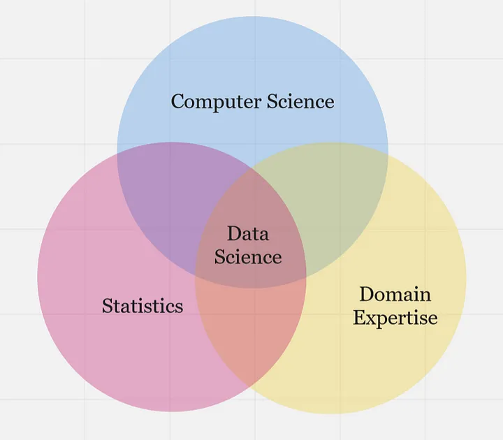

# Building blocks and Workflow

## Building blocks
Previously, we described data science as a multidisciplinary field. At the high level, data science is typically an intersection of 3 core areas - _statistics, computer science_, and _domain expertise_. Altogether, these three areas form the building blocks of data science, allowing practitioners to collect, process, analyze, and visualize data in a way that generates valuable insights and informs decision-making processes in various industries and domains.

...statistics, computer science, and domain knowledge are all essential components of data science, and each plays a critical role in the data science process as highlighted below.

- **Statistics** - provides the foundational concepts and methods for collecting, analyzing, and interpreting data. This is essential for understanding the data itself, including identifying patterns, testing hypotheses, and making predictions. 
- **Computer Science** - provides the computational and programming tools needed to manipulate, process, and visualize data at scale, such as tools and infrastructure necessary to work with data at scale. This includes programming languages like Python and R, as well as tools like SQL, Hadoop, and Spark.
- **Domain Expertise** - refers to expertise in a specific field or industry, which is critical for understanding the context of the data being analyzed and generating insights that are relevant and useful.  Domain knowledge is particularly important in fields like healthcare, finance, and engineering, where specialized knowledge is required to make informed decisions based on data.

In summary, data science building blocks are an intersection of statistical methods, computer science tools, and domain knowledge, which are used together to extract insights and generate value from data. Now, how does a typical data science project looks like?

### Data science workflow
<aside>

📺 A typical end-to-end journey of a data science project 👨🏾‍💻

</aside>

<iframe src="https://www.youtube.com/embed/X3paOmcrTjQ?start=10" title="Sample Data Science Project" frameborder="0" allow="accelerometer; autoplay; clipboard-write; encrypted-media; gyroscope; picture-in-picture" allowfullscreen style="position: absolute; top: 0; left: 0; width: 100%; height: 100%;"></iframe>

In summary, a typical data science project workflows includes;

- **Problem formulation**: involves work with stakeholders to clearly define the problem they are trying to solve, identify the key objectives, and develop a plan for data-driven decision-making.

- **Data collection**: This involves obtaining data from various sources, including databases, APIs, and web scraping.

- **Data Preparation**: This involves cleaning, transforming, and structuring data in a way that is suitable for analysis.

- **Exploratory Data Analysis (EDA)**: This involves exploring and analyzing data using statistical and machine learning techniques to identify patterns and trends.

- **Data Modelling**: This involves using algorithms to develop predictive models that can be used to make informed decisions based on data.

- **Visualization and Communications**: This involves creating visual representations of data to communicate insights and findings to stakeholders.

- **Deployment and Maintenance**: This involves turning the model into a product and hosting it online for wider access.

Throughout the entire data science workflow, data scientists need to collaborate closely with stakeholders, communicate their findings clearly, and continuously refine their methods and models based on feedback and new insights.

> 👉🏾 In the next section, we'll look at the role of data in decision-making, and understand different data categories.
