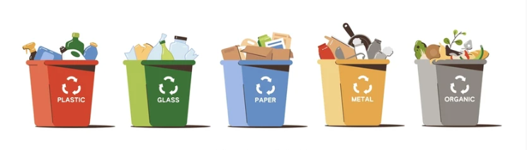
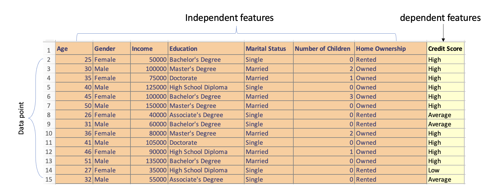
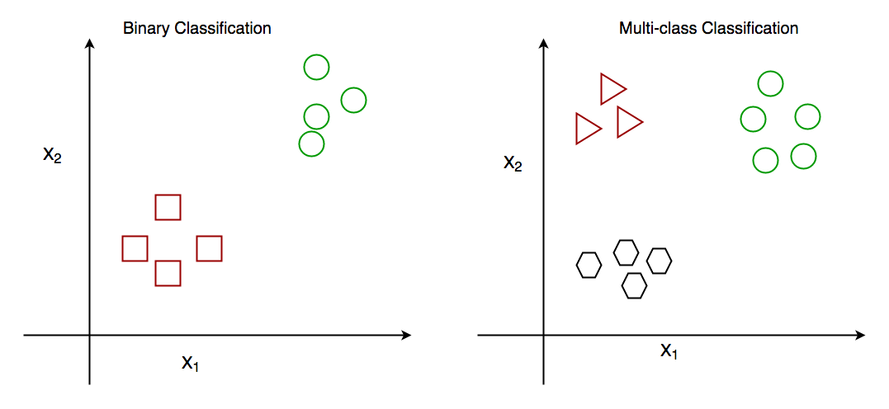

# ML Classification
Classification in machine learning is like teaching a computer to sort waste items into different bins based on patterns and characteristics it learned from labeled examples. It is a techniques used in supervised learning to carry out predefined task. The learning path for the model depends on both the data and the problem we are trying to solve. 

##  Classification
Imagine you have a big pile of waste materials, and you want to organize them into different bins based on the type of waste. You have plastic bottles, glass containers, paper, metal cans, and organic waste like food scraps. Sorting them by hand could be time-consuming, so you decide to use a machine learning technique called classification to help you with the task.

In machine learning, classification is like having a smart assistant that can automatically identify and sort each waste item into the right bin. Just like you might look at the shape, color, and texture of each item to determine its type, the classification model uses patterns and features from the waste items to make predictions.

<aside>

**_Definition..._**

_Classification_ is a technique used in finding the right model or pattern that can separate a data into predefined categories or classes. This is done by deriving a mapping function between the `dependent` and `independent` features.
</aside>

<iframe src="https://www.youtube.com/embed/8TuRJg76sW8" title="Machine Learning" frameborder="0" allow="accelerometer; autoplay; clipboard-write; encrypted-media; gyroscope; picture-in-picture" allowfullscreen style="position: absolute; top: 0; left: 0; width: 100%; height: 100%; border: 2px solid grey;"></iframe>

In classification, the model is trained on a set of labeled data, which means that the data has been pre-classified into different categories, such as plastic, glass, paper, metal, and organic. 

Another example of labeled dataset is given in the diagram below. Independent features are all features in the dataset except the feature we are trying to predict, which is called the dependent feature because its values depend on other features. Each row in the dataset is refrred to as a `data point`.

Using the labelled data, the model learns to map the input data to the correct category by adjusting its parameters over time through a process called `gradient descent`, which essentially involves finding the set of parameters that minimizes the error between the model's predictions and the actual class or label.

<aside>

**_ NOTE! _**

- Dependent and independent features are also refered to as dependent and independent variables.
- Dependent feature can sometimes be called label, class, category, or target.
</aside>

### Binary vs Multi-class classification
Binary classification is a task where the model is only trained to predict one of two categories, for example, a binary classification model could be used to predict whether an email is _spam_ or _ham_, or whether a student will _pass_ or _fail_. In multi-class classification, the model is trained to predict one of more than two categories. For example, to predict the species of a flower (setosa, versicolor, or virginica), or the final grade of a student in a course - A, B, C, D, E or F.

The main difference between binary classification and multi-class classification is the number of categories that the model is trained to predict. In binary classification, the model is only trained to predict one of two categories, while in multi-class classification, the model is trained to predict one of more than two categories.

Here is a code snippet of a binary classification model that classifies whether a student will pass or fail. Play around with the `new_student_df` to test and see the changes.

<iframe src="https://trinket.io/embed/python3/8617dc97c2?toggleCode=true&runOption=run" width="100%" height="356" frameborder="0" marginwidth="0" marginheight="0" allowfullscreen></iframe>

In this code snippet, we use the `RandomForestClassifier` algorithm to build the classification model. It trains on the features such as 'hours_studied', 'previous_grade', 'attendance_percentage', 'test_score', 'homework_score', 'extracurricular_activities', and 'class_participation' to predict whether a student will `pass` or `fail`. The model is then evaluated using accuracy.

Finally, we created a new student data who studied for 6 hours, had a previous grade of 80, an attendance percentage of 92, test score of 85, homework score of 88, and participates in class discussions (1). This is simply to test the model.

<aside>

**_Lesson summary..._**

Classification is a technique used in finding the right model or pattern that can separate a data into predefined categories or classes. This is done by deriving a mapping function between the dependent and independent features. 

Just like you might look at the shape, color, and texture of an item to determine its type, the classification model uses patterns and features from the data  to make predictions.

In binary classification, the model is only trained to predict one of two categories, while in multi-class classification, the model is trained to predict one of more than two categories
</aside>

### 👩🏾‍🎨 Practice: Classification in ML... 🎯

1. Suppose an online shoe store wants to create a supervised ML model that will provide personalized shoe recommendations to users. That is, the model will recommend certain pairs of shoes to Marty and different pairs of shoes to Janet. The system will use past user behavior data to generate training data. Which of the following statements are true?

    - `Shoe size` is a useful feature.
    - `The user clicked on the shoe's description` is a useful label.
    - `Shoe beauty` is a useful feature.
    - `Shoes that a user adores` is a useful label.

> ➡️ Next, we'll look at `regression in ML`... 🎯

