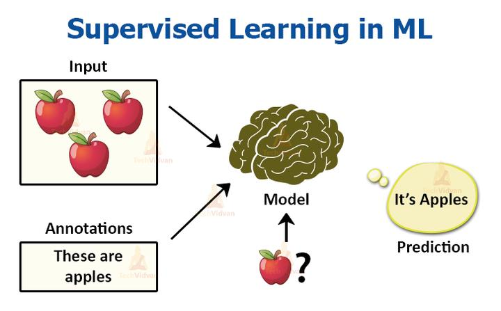

# Supervised learning
Imagine you have a really smart friend who loves to play a guessing game with you. They give you pictures of different animals, like cats and dogs, and tell you what each animal is. Your friend wants you to learn from these examples, so they can show you new pictures of animals you haven't seen before, and you can try to guess what they are based on what you've learned.

Supervised learning is a lot like this guessing game with your friend. In this type of machine learning, the computer is the "learner," and it's given labeled examples as `training data`. Each example consists of both the picture of the animal (input) and the name of the animal (output). The computer's job is to learn from these examples, just like you did from your friend, so that it can correctly guess the names of animals it hasn't seen before.

<aside>

**_Definition..._**

_Supervised learning_ is a process of training a computer on a set of labeled data. This means that the data has been pre-classified, so the model knows what the correct output should be for each input. 
</aside>

For example, if you are training a model to classify images of cats and dogs, the data would be a set of images, each with a label that says whether it is a cat or a dog. _But how do we build a model or train a machine_?

Building a model means you're training a machine to perform a specific task. To do this, there are dependent steps we need to take as listed below.

1. Data collection and cleaning - collection and cleaning of dataset.
2. Feature engineering - transforming and structuring the data for analysis or modelling.
3. Data Modelling - using algorithms to develop predictive models.

So far, we've covered step 1 and 2 in previous weeks, and the final dataset serves as the input into the modelling phase. Now, let's look at data modelling by breaking it down into `ML algorithms`, `training`, `validation`, and `testing`.

## ML Algorithms
Imagine you have a friend who loves solving puzzles. You give them a bunch of puzzle pieces with pictures on them and tell them to figure out what the complete picture looks like. Your friend starts to put the pieces together, trying different combinations, and learning from their mistakes until they complete the puzzle.

<aside>

**_Definition..._**

_Machine learning algorithms_ are sets of mathematical rules and procedures that enable computers to learn from data and make predictions or decisions without being explicitly programmed. 
</aside>

These algorithms form the core of machine learning, as they are responsible for extracting patterns and relationships from the data and using that knowledge to perform specific tasks. Just like your friend uses different strategies to put the puzzle pieces together, ML algorithms learn from data and make smart choices. 

There are various types of machine learning algorithms, each designed for different types of tasks and data. Some common types of supervised ML algorithms include:

- Linear regression
- Support vector machines
- Decision trees
- Naive bayes

We'll be using some of these algorithms to perform specific tasks as we move on in the course. To train an ML agorithm, we need to split our dataset into 3 different categories: `training`, `validation`, and `testing`. As a rule of thumb, the percentage of data in each category can be `70%` for training, `20%` for validation, and `10%` for testing.

## Training
Suppose you have a friend who loves playing video games. You want to help them become better at a specific game, so you decide to train them by showing them different game scenarios and guiding them through each level.

In ML, model training is a bit like this gaming scenario. The `model` is the computer's way of learning and making predictions, just like your friend is learning to play the game. To train the model, you provide it with lots of examples, like different game situations, and tell it what the correct outcome should be for each example. This information is called `training data`.

<iframe src="https://www.youtube.com/embed/x2mRoFNm22g" title="Machine Learning" frameborder="0" allow="accelerometer; autoplay; clipboard-write; encrypted-media; gyroscope; picture-in-picture" allowfullscreen style="position: absolute; top: 0; left: 0; width: 100%; height: 100%; border: 2px solid grey;"></iframe>

ML algorithms uses this _training data_ to learn patterns and rules, just like your friend learns from playing different game scenarios. It automatically adjusts its settings and calculations, trying to make its predictions as accurate as possible based on the training data. As the training continues, the model gets better and better at making predictions on new, unseen data, just like your friend improves their gaming skills with practice.

## Validation and testing
Model validation and testing are two important steps in the ML process. They help to ensure that the ML model is accurate and reliable. In the video game example, model validation and testing is about making sure your friend's gaming skills are reliable and can handle different challenges, just like how they performed during training.

After the training, you want to check if your friend's gaming skills are truly good and not just based on specific situations they've seen before. In machine learning, this is called `model validation and testing`. It involves presenting the model with new or unseen data to assess its performance on real-world situations.

The goal of model testing is to ensure that the model is not just memorizing the examples from training but can actually apply what it learned to make useful predictions on new, real-world data. This process helps you assess the model's performance and make sure it's reliable for the tasks you want it to perform.

As a recap, check the video below to get a summary of training, validation, and testing.

<iframe src="https://www.youtube.com/embed/dSCFk168vmo" title="Machine Learning" frameborder="0" allow="accelerometer; autoplay; clipboard-write; encrypted-media; gyroscope; picture-in-picture" allowfullscreen style="position: absolute; top: 0; left: 0; width: 100%; height: 100%; border: 2px solid grey;"></iframe>

<!--  -->

<aside>

**_Lesson summary..._**

The goal of **supervised learning** is to teach the computer to make accurate predictions on new, unseen data based on what it learned from the labeled examples. It's like your friend guiding you in the guessing game by giving you the correct answers during training. Supervised learning is used in various real-world applications, such as recognizing objects in images, predicting prices of houses, and even diagnosing diseases from medical data. Just like your smart friend helped you become better at guessing animals, supervised learning helps computers become smarter at making predictions!
</aside>

### 👩🏾‍🎨 Practice: Supervised learning... 🎯

Suppose you want to develop a supervised machine learning model to predict whether a given email is "spam" or "not spam." Which of the following statements are true?
- Emails not marked as "spam" or "not spam" are unlabeled examples.
- We'll use unlabeled examples to train the model.
- Words in the subject header will make good labels.
- The labels applied to some examples might be unreliable.

 

> ➡️ Next, we'll look at `classification and regression`... 🎯
