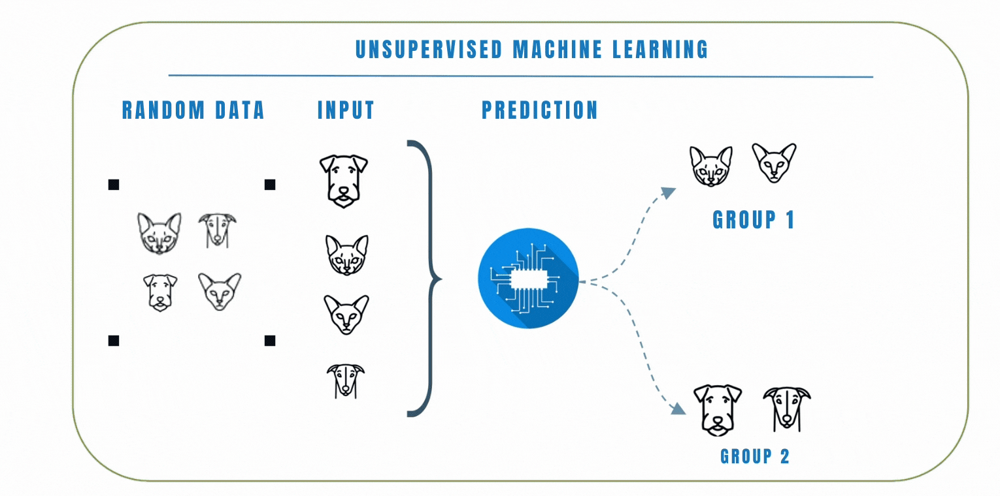

# Unsupervised learning
Unsupervised learning in ML is like letting the computer discover hidden patterns and relationships in data all on its own, without any specific guidance. It's a bit like a curious explorer that searches for interesting things in a big collection of objects.

Unlike supervised learning where the model is trained on a labelled dataset, this means that the data does not have any pre-defined labels, so the model has to learn to find patterns in the data on its own.

<aside>

**_Definition..._**

Unsupervised learning, also known as unsupervised machine learning, uses machine learning algorithms to analyze and group unlabeled datasets. These algorithms discover hidden patterns or data groupings without the need for human interventions.
</aside>

<iframe src="https://www.youtube.com/embed/JbP9EPPvVXg" title="Machine Learning" frameborder="0" allow="accelerometer; autoplay; clipboard-write; encrypted-media; gyroscope; picture-in-picture" allowfullscreen style="position: absolute; top: 0; left: 0; width: 100%; height: 100%; border: 2px solid grey;"></iframe>

## Clustering
In unsupervised learning, clustering is a popular technique we can use to group similar data points together based on their similarities. The goal of clustering is to find patterns or structures in the data without the need for explicit labels or predefined categories. `K-Means` and `Hierarchical clustering` are common clustering algorithms used in unsupervised learning. Let's look at these 2 algorithms by watching the video below.

 

<iframe src="https://www.youtube.com/embed/IUn8k5zSI6g" title="Machine Learning" frameborder="0" allow="accelerometer; autoplay; clipboard-write; encrypted-media; gyroscope; picture-in-picture" allowfullscreen style="position: absolute; top: 0; left: 0; width: 100%; height: 100%; border: 2px solid grey;"></iframe>

In a similar scenario, let's consider another example where we have a dataset of emojis that includes emotions such as `angry`, `sad`, and `happy`. Each emoji is represented by certain features like _colors_, _shapes_, and _facial expressions_. Using clustering, we can group similar emojis together based on their features.

For example, emojis with red colors and frowning facial express
ions might be grouped as angry emojis. Emojis with blue colors and tears in their eyes might be grouped as sad emojis, while emojis with bright colors and smiling faces might be grouped as happy emojis.

<aside>

**_Lesson summary..._**

Unlike supervised learning, where you teach the computer by providing examples with specific labels (like telling it which toys are cars or teddy bears), unsupervised learning doesn't rely on any predefined categories. Instead, the computer explores the data on its own to find interesting groupings and patterns that you might not have noticed before. 

This way, unsupervised learning can be great for discovering hidden insights in data and can be useful in many real-world applications, like finding customer segments in a dataset or organizing data into meaningful clusters
</aside>

### 👩🏾‍🎨 Practice: Unsupervised learning... 🎯

- Which of the following statements best describes clustering in the context of machine learning?
    - Clustering is a technique used to train models on labeled data.
    - Clustering involves grouping similar data points together based on certain criteria.
    - Clustering is only applicable to classification problems.
    - Clustering is primarily used to predict numerical outcomes.

- Which of the following statements is true about K-Means clustering?
    - K-Means clustering is used for text analysis only.
    - K-Means clustering aims to minimize the number of clusters.
    - K-Means clustering requires the number of clusters (k) to be specified in advance.
    - K-Means clustering is not suitable for datasets with a large number of features.
 

> ➡️ Next, we'll look at `Reinforcement learning`... 🎯